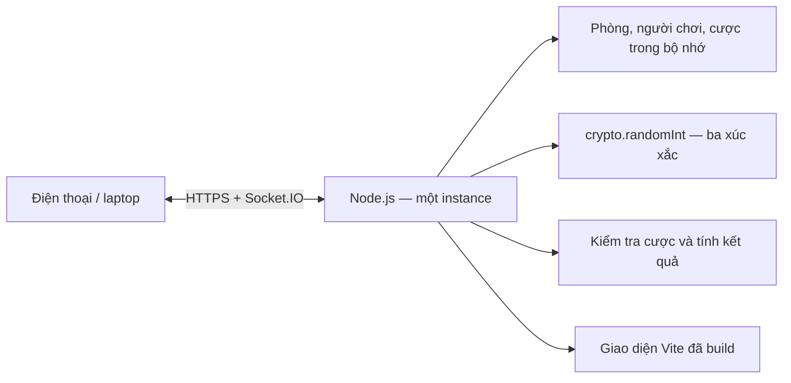

# Bầu Cua Arena

Game bầu cua chơi chung phòng trên điện thoại và laptop, tối đa **20 người/phòng**. Server tự mở cược 30 giây, lắc và tính xu riêng cho từng người; sau 5 giây xem kết quả sẽ mở ván mới. Chỉ sử dụng xu ảo, không nạp/rút hay đổi tiền. Xem [bàn tự động và quyền host](docs/AUTOMATIC_ROOMS.md).
- Còn cần triển khai Internet trên Render mọi người ai biết làm hosting hoặc đã từng deploy web rồi nhắn nhóm zalo nhận việc mình làm được mà lấy kinh nghiệm.

## Chạy trên máy

Yêu cầu Node.js 24.x và npm.

```sh
npm ci
npm run build
npm start
```

Mở **http://localhost:3000**. Một tiến trình phục vụ cả giao diện đã build, HTTP API và Socket.IO. Giữ tiến trình chạy khi sử dụng; sau khi khởi động lại máy cần chạy lại `npm start`.

Khi sửa giao diện, dùng hai terminal:

```sh
# Terminal 1
npm run server
# Terminal 2
npm run dev
```

Mở **http://localhost:5173**. Vite chuyển `/api` và `/socket.io` tới Node cổng 3000. Không chạy thêm một Node server khác nếu cổng 3000 đã được sử dụng. Trên PowerShell nếu `npm.ps1` bị chặn, dùng `npm.cmd` thay cho `npm`.

## Cách chơi cùng bạn bè

1. Nhập tên và tạo phòng. Người tạo là chủ phòng, cũng có thể đặt cược.
2. Gửi link mời hoặc mã phòng cho bạn bè. Mỗi trình duyệt/tab là một người chơi, tối đa 20 ghế.
3. Ván mở ngay khi tạo phòng. Chọn chip, số xu tùy chọn hoặc All-in rồi bấm biểu tượng; server xác nhận cược.
4. Hết 30 giây, server khóa cược và tự lắc. Sau hiệu ứng ngắn, cả phòng xem cùng ba biểu tượng.
5. Theo dõi số xu, bảng xếp hạng và lịch sử; ván tiếp theo tự mở sau 5 giây.

Ví dụ cược 50 xu vào Cua: xuất hiện 0 lần → nhận 0; 1 lần → nhận 100; 2 lần → nhận 150; 3 lần → nhận 200. Số nhận đã bao gồm hoàn cược. Lãi/lỗ = tổng nhận − tổng cược.

Cược không làm giảm số dư cho tới khi chốt ván. Tổng cược được giữ trong giới hạn số dư. Người vào trong thời gian cược có thể chơi ngay. Người mất kết nối vẫn được tính kết quả cho cược đã nhận. Khôi phục cùng tab sẽ dùng phiên cũ; chủ phòng mất mạng được chuyển quyền sau một khoảng chờ ngắn. Host có thể tạm dừng, khóa phòng, cấp xu, đuổi người, chuyển quyền, hủy ván chưa lắc để hoàn cược hoặc đặt lại phiên khi không có cược chưa chốt. Kết quả do host chọn được đánh dấu là ván demo.

## Kiến trúc



- **Frontend:** HTML/CSS và JavaScript ES modules, Vite. Socket.IO client nhận trạng thái chính thức; không tự tính số dư quyết định.
- **Server:** Node HTTP, Socket.IO, `node:crypto`. Các phòng độc lập, phát snapshot theo từng người.
- **Chống xử lý lặp:** requestId chống cộng cược hai lần; roundId chặn yêu cầu từ ván cũ; server kiểm tra quyền chủ phòng.
- **Kết nối lại:** token riêng trong sessionStorage của từng tab, không đưa vào link mời hoặc trạng thái công khai. Mất phản hồi thì đồng bộ lại, không tự gửi cược lặp.
- **Giới hạn tài nguyên:** tối đa người/phòng, lịch sử, phòng, tốc độ lệnh, bộ nhớ chống lặp và thời hạn phiên/phòng.

Chi tiết giao tiếp: [docs/REALTIME_PROTOCOL.md](docs/REALTIME_PROTOCOL.md).

## Kiểm thử

```sh
npm test
npm run build
```

`tests/game.test.js` kiểm tra luật và các bảo vệ của server. `tests/multiplayer.test.js` dùng Socket.IO client thật kết nối tới server ở cổng ngẫu nhiên, bao gồm 20 người đồng thời, giới hạn người thứ 21, lặp lệnh, cược sai/vượt xu, quyền chủ phòng, vào trễ, hai phòng độc lập, kết nối lại và API HTTP. Kết quả kiểm thử cụ thể được ghi trong [docs/TEST_RESULTS.md](docs/TEST_RESULTS.md).

## Đưa lên Internet và thuyết trình

- [Hướng dẫn Render](docs/DEPLOY_RENDER.md) — triển khai cùng một dịch vụ cho web và Socket.IO.
- [Kịch bản thuyết trình 7 phút](docs/PRESENTATION.md) — demo trước, giải thích kiến trúc sau.
- Có `Dockerfile` để chạy trên VPS: `docker build -t bau-cua-arena .`, rồi `docker run --rm -p 3000:3000 bau-cua-arena`.

Chưa có URL Internet được triển khai trong lần làm này; cần tài khoản hosting của bạn. `render.yaml` chỉ là cấu hình, không tự tạo dịch vụ hoặc phát sinh thanh toán.

## Giới hạn hiện tại

- Phòng, lịch sử và phiên ở RAM; restart/deploy/sleep làm mất phiên. Chỉ chạy **một instance**, chưa có lưu trữ lâu dài hoặc phân tán.
- Tên và mã phòng phù hợp chơi cùng nhóm; không có tài khoản xác thực. Người biết mã có thể tham gia khi còn ghế.
- Phiên ở sessionStorage: reload cùng tab có thể khôi phục khi server còn giữ phiên; tab mới là danh tính mới. Không chia sẻ token.
- Kiểm thử 20 kết nối cục bộ không thay thế đo độ trễ trên Internet/thiết bị thật; phải diễn tập trên hosting trước buổi trình bày.
- Xúc xắc do server sinh bằng crypto; không tuyên bố có kiểm toán độc lập hay cơ chế chứng minh công bằng mật mã.
- Xu ảo chỉ phục vụ trò chơi, không có giá trị tiền tệ.
