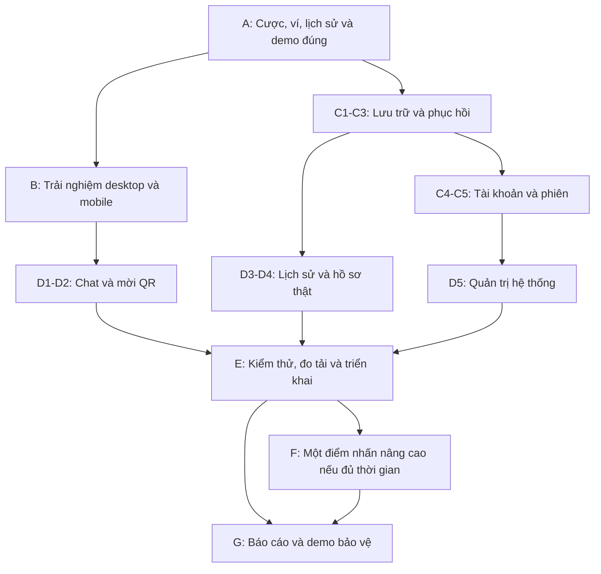

# Kế hoạch phát triển Bầu Cua Victory

Ngày lập: 21/09/2026. Phạm vi: trò chơi web nhiều người sử dụng xu ảo. Tài liệu này là kế hoạch, chưa triển khai các tính năng mới.

> Bổ sung ngày 22/09: yêu cầu mới chốt ví tài khoản chung qua các phòng, quảng cáo thưởng khi hết xu, admin hệ thống quản lý xu/người chơi/phòng; host chỉ tạo phòng và kick. Khi có khác biệt về phân quyền hoặc tài khoản, dùng [kế hoạch tài khoản, ví và admin](KE_HOACH_TAI_KHOAN_VI_ADMIN.md) làm thiết kế mới nhất. Các quyền host mô tả trong phần hiện trạng dưới đây là mã cũ cần thay đổi.

## 1. Đích đến

Hoàn thiện một sản phẩm có thể trình diễn trên máy tính và điện thoại, dữ liệu chính xác, thao tác rõ ràng, phục hồi được khi có lỗi, và có tài liệu chứng minh các quyết định kỹ thuật.

Chưa có thang chấm hoặc hạn nộp của môn học. Do đó đây là lộ trình theo mức ưu tiên, không phải lời cam kết điểm số. Khi có rubric, gắn từng yêu cầu của giảng viên với hạng mục và bằng chứng tương ứng.

Ba mốc sản phẩm:

- **Bản ổn định:** sửa các lỗi hiện có, thống kê thật, dữ liệu phòng minh bạch, demo hai thiết bị tốt.
- **Bản đồ án hoàn chỉnh:** thêm cơ sở dữ liệu, hồ sơ người chơi, chat, lịch sử lâu dài, quản trị, kiểm thử và triển khai có hướng dẫn.
- **Bản nâng cao:** chọn thêm một điểm nhấn đã đo/kiểm chứng; chỉ thực hiện khi hai mốc trước đạt.

## 2. Nền tảng đã có và khoảng trống

Đã có phòng Socket.IO tối đa 20 người, ván tự động, quyền host, chip 1K–500K/ALL IN, trừ xu khi nhận cược, xóa/hủy hoàn xu, trả thưởng, mở bát kéo 360°, âm thanh, fullscreen giữ 16:9 và khôi phục phiên theo tab.

Lần kiểm tra ngày 21/09/2026: 18/18 test hiện có đạt. Bộ test này chưa thay thế nghiệm thu giao diện trên điện thoại thật.

Các khoảng trống đã xác định từ mã nguồn:

| Vấn đề | Hệ quả | Hạng mục xử lý |
|---|---|---|
| Nút ĐẶT CƯỢC chỉ phát thông báo; cược gửi khi chạm linh thú | Dễ hiểu sai rằng tiền chỉ cược sau khi bấm nút | A1 |
| Server cũ/mới khác cách diễn giải số dư | Có thể hiển thị chip/tiền không khớp, lớp tương thích cũ trừ lại ở pha kết quả | A2 |
| Thống kê linh thú dùng số ngẫu nhiên, online tối thiểu 123 | Không chứng minh được dữ liệu khi trình diễn | A3 |
| Lịch sử mới nhất nằm đầu nhưng UI lấy cuối danh sách | Có thể bỏ mất kết quả mới khi đủ nhiều ván | A3 |
| Host chọn kết quả demo nhưng khách không nhận cờ demo | Người chơi không biết đang ở chế độ minh họa | A4 |
| Đuổi người trong thời gian cược chưa có chính sách hoàn rõ | Rủi ro mất quyền theo dõi cược đã nhận | A5 |
| Phòng, phiên và lịch sử ở RAM | Restart mất dữ liệu | C1–C3 |
| Chat mới có nút; giao diện di động chưa nghiệm thu đủ | Tính năng chưa hoàn chỉnh | B1, D1 |

## 3. Giai đoạn A — sửa tính đúng đắn trước

Ưu tiên bắt buộc; hoàn thành trước khi thêm tính năng lớn.

| Mã | Việc cần làm | Tiêu chí hoàn thành |
|---|---|---|
| A1 | Giữ cơ chế chọn chip → chạm linh thú → cược ngay. Chuyển nút ĐẶT CƯỢC thành chức năng xem cược đã nhận hoặc bỏ nếu dư thừa. Hiện trạng thái đang gửi/thất bại rõ ràng | Chưa cược, mất mạng hoặc bị từ chối không báo thành công; hết giờ không thêm được cược |
| A2 | Chốt một cách hiểu số dư khả dụng; kiểm tra phiên bản cấu hình/server khi kết nối; giới hạn lớp tương thích cũ theo pha và loại bỏ sau khi nâng cấp đồng bộ | Cược giảm ngay sau ACK; xóa/hủy hoàn đúng; trả thưởng không trừ lần nữa; ALL IN dùng đúng phần còn lại |
| A3 | Tính thống kê từ kết quả thật; hiển thị online theo người đang kết nối; sửa thứ tự lịch sử; bỏ hoặc gắn nhãn rõ VIP mẫu | Một bộ ván có kết quả biết trước cho đúng số đếm/tỉ lệ; không có dữ liệu ngẫu nhiên trang trí bị hiểu là thật |
| A4 | Chọn chế độ demo/ngẫu nhiên khi tạo phòng, không đổi trong ván đang cược. Demo có nhãn cho cả phòng; phòng ngẫu nhiên từ chối ép kết quả ở server | Khách nhìn thấy chế độ trước khi cược; test xác nhận server chặn lệnh không phù hợp |
| A5 | Khi host đuổi người ở pha cược: hoàn cược và ghi lý do trước khi thu hồi phiên; pha đang lắc tiếp tục chặn theo quy tắc hiện có | Cược không biến mất âm thầm; tổng tiền hoàn có thể đối chiếu |
| A6 | Đồng bộ lại khi timeout chưa biết server đã nhận cược hay chưa; dùng cùng mã yêu cầu nếu có cơ chế gửi lại | Mô phỏng mất ACK rồi nối lại không bị đặt cược hai lần hoặc mất dấu cược |

Ví dụ nghiệm thu A2: ví 100.000, cược 10.000 → còn 90.000; xóa → 100.000; cược lại và ra hai Cua → nhận 30.000, ví cuối 120.000. Kiểm tra cùng lúc trên máy người chơi và danh sách phòng.

Thống kê phải định nghĩa rõ mẫu số: **tần suất mặt xúc xắc** = số mặt của linh thú / tổng mặt đã công bố; **tỉ lệ ván có xuất hiện** = số ván có linh thú / số ván đã công bố. Hai chỉ số không giống nhau. Không tính ván chưa công bố vào bảng đang xem.

## 4. Giai đoạn B — giao diện và trải nghiệm hoàn chỉnh

| Mã | Tính năng/cải tiến | Tiêu chí hoàn thành |
|---|---|---|
| B1 | Sảnh thích ứng chiều cao, phần nhập liệu cuộn được khi cần; nghiệm thu fullscreen 16:9 và nền mờ | Tên, mã phòng, nút tạo/vào luôn truy cập được khi xoay máy hoặc mở bàn phím |
| B2 | Khay 1K–500K + ALL IN phù hợp màn hình nhỏ; thông báo không đủ xu; trạng thái chip chọn rõ | Bảy lựa chọn không bị cắt hoặc che; chip trên bàn đúng linh thú sau xoay/fullscreen |
| B3 | Kéo bát mượt, chống nhảy lúc nhấn giữ, hỗ trợ mở bằng nút/phím và giảm chuyển động | Chuột, touch, kéo chéo, hủy thao tác và resize không làm bát mất vị trí |
| B4 | Bảng kết quả cá nhân: đã cược, tổng nhận, lãi/lỗ và số dư cuối | Con số khớp server; không nhầm tổng nhận với tiền lời |
| B5 | Hướng dẫn lần đầu ngắn; điều chỉnh âm lượng nhạc/hiệu ứng riêng; lưu tùy chọn thiết bị | Người mới có thể tự vào phòng và cược; thiết lập được giữ sau tải lại |
| B6 | Phản hồi mất mạng, đang nối lại, phòng hết hạn; phím Tab, nhãn nút và focus rõ | Không mắc kẹt ở sảnh “đang kết nối”; bàn phím và người dùng giảm chuyển động vẫn thao tác được |

Ma trận nghiệm thu gồm: desktop cửa sổ và fullscreen; Android Chrome ngang/dọc; iPhone Safari ngang/dọc; chế độ thêm vào màn hình chính nếu dùng. Ghi rõ phiên bản máy/trình duyệt đã thử; không tuyên bố “mọi trình duyệt” từ một ảnh chụp.

## 5. Giai đoạn C — cơ sở dữ liệu và danh tính người chơi

Đây là bước tăng chiều sâu kỹ thuật rõ nhất sau khi bản chơi ổn định. Giữ một backend trước; chỉ mở rộng nhiều server khi có nhu cầu và phép đo.

| Mã | Tính năng | Tiêu chí hoàn thành |
|---|---|---|
| C1 | Lưu người chơi, phòng, thành viên, ván, cược và sổ giao dịch xu trong cơ sở dữ liệu quan hệ | Có sơ đồ dữ liệu, migration và dữ liệu mẫu; đọc lại lịch sử sau restart |
| C2 | Ghi nhận cược/trừ xu/hoàn/thưởng bằng transaction và khóa chống lặp | Không có số dư âm; mỗi lệnh hợp lệ chỉ tạo một thay đổi tiền; hai lệnh đồng thời không vượt ví |
| C3 | Quy tắc phục hồi ván khi server khởi động lại | Ván đã chốt không thanh toán lần hai; ván chưa chốt được hoàn cược và đóng với lý do phục hồi, có log đối chiếu |
| C4 | Tài khoản đăng ký/đăng nhập/đăng xuất, hồ sơ và avatar có sẵn; vẫn cho phép chơi khách nếu phù hợp phạm vi | Người có tài khoản xem lại đúng lịch sử; phiên hết hạn được xử lý; người khác không đọc được dữ liệu riêng |
| C5 | Mật khẩu được băm bằng cơ chế chuyên dụng, phiên đăng nhập có hạn, giới hạn thử đăng nhập và xác minh quyền ở server | Không lưu mật khẩu rõ/token trong log; API và Socket.IO đều không tin vai trò do client tự gửi |

Các nhóm dữ liệu đề xuất:

- `users`, `sessions`: danh tính và đăng nhập; tách biệt với quyền host theo phòng.
- `rooms`, `room_members`: phòng, chế độ, cấu hình, thành viên và quyền hiện tại.
- `rounds`, `bets`: kết quả ván, trạng thái, cược được nhận và mã yêu cầu.
- `wallet_transactions`: sổ biến động xu với loại cược/hoàn/thưởng/cấp xu, số tiền và liên kết ván/lệnh.
- `chat_messages`, `admin_audit_logs`: tin nhắn và thao tác quản trị cần truy vết.

Lưu đủ dữ liệu để chứng minh `số dư đầu + tổng biến động = số dư cuối`. Không xem Redis hoặc cache đơn thuần là thay thế sổ giao dịch bền vững.

## 6. Giai đoạn D — các tính năng nên thêm

| Mã | Tính năng | Mức ưu tiên và phạm vi |
|---|---|---|
| D1 | Chat realtime trong phòng | Nên có: tên, giờ gửi, giới hạn ký tự/tốc độ, chặn HTML thực thi; tùy chọn tắt chat của host |
| D2 | Mời bằng mã QR và sao chép liên kết | Nên có: giảm thao tác nhập mã khi demo hai thiết bị; không chứa token đăng nhập |
| D3 | Lịch sử cá nhân, giao dịch xu và chi tiết từng ván | Nên có sau C1: phân trang, lọc ngày/phòng, cược từng linh thú, tiền nhận, lãi/lỗ, số dư trước/sau và lý do cấp/hoàn xu |
| D4 | Hồ sơ thành tích từ dữ liệu thật | Nên có: số ván, tổng cược, tổng nhận, tỉ lệ thắng; quy định ván không cược không làm tăng thành tích |
| D5 | Trang quản trị hệ thống | Nên có sau C4: phòng đang hoạt động, người kết nối, sự kiện lỗi, nhật ký cấp xu/hủy/đuổi; tách quyền admin hệ thống với host phòng |
| D6 | Danh sách phòng công khai và phòng riêng | Có thể thêm: sức chứa, trạng thái, chế độ, mã/mật khẩu phòng; kiểm tra quyền vào ở server |
| D7 | Đặt lại bộ cược ván trước | Tùy chọn tiện ích: chỉ khi còn thời gian và đủ xu; server chấp nhận cả bộ hoặc từ chối cả bộ; chống nhấn lặp |
| D8 | Chế độ hướng dẫn luyện tập riêng | Tùy chọn điểm nhấn: giải thích trả thưởng bằng ví dụ, không trộn kết quả/điểm vào phòng chơi chung |

Với bảng xếp hạng toàn hệ thống, cần quy tắc trước khi làm: xu do host/admin cấp không được tạo thành tích thắng; ván demo không vào bảng thi đấu. Có thể ưu tiên bảng xếp hạng theo phiên với số xu khởi đầu bằng nhau. Chưa cần triển khai bảng toàn hệ thống nếu chưa giải quyết các điều kiện này.

## 7. Giai đoạn E — chất lượng kỹ thuật và vận hành

| Mã | Việc cần làm | Bằng chứng bàn giao |
|---|---|---|
| E1 | Tách `main.js` theo kết nối, cược, lịch sử, quản trị, âm thanh và fullscreen | Sơ đồ module, giao diện chức năng rõ, không đổi hành vi ngoài yêu cầu |
| E2 | Tối ưu ảnh/âm thanh theo kích thước sử dụng; ưu tiên tải tài nguyên cần trước | Bảng request và dung lượng thực tải trước/sau; so hình để giữ độ nét và nền trong suốt |
| E3 | CI chạy kiểm thử và build; thống nhất cấu hình giữa local và triển khai | Một bản checkout sạch cài/chạy theo README; CI báo lỗi trước khi phát hành |
| E4 | Log cấu trúc có mã phòng/ván/yêu cầu, health check, thông tin phiên bản | Truy được một thao tác lỗi; không log mật khẩu hoặc token phiên |
| E5 | Triển khai một địa chỉ HTTPS ổn định và diễn tập qua Internet | Hai thiết bị trên mạng khác nhau cùng chơi; có hướng dẫn restart, sao lưu và khôi phục |
| E6 | Kiểm thử tự động đúng rủi ro | Unit luật trả thưởng; integration cược/transaction/reconnect/phân quyền; browser test các luồng quan trọng |
| E7 | Đo tải nhiều phòng và độ trễ thay vì chỉ đếm số socket | Báo cáo cấu hình máy, số phòng/người, độ trễ ACK p50/p95, lỗi và bộ nhớ; không suy ra tải Internet từ test local |

Tiêu chí chất lượng trước phát hành:

- Không còn lỗi mức nghiêm trọng làm sai xu, sai ván, mất dữ liệu hoặc vượt quyền.
- Không có thông báo thành công nếu thao tác chưa được xác nhận.
- Luồng tạo phòng → vào → cược → mở bát → kết quả chạy được trên hai thiết bị thật.
- Có kết quả kiểm tra mạng yếu, mất kết nối và tải lại; không khẳng định offline multiplayer.
- Đo tốc độ ban đầu rồi đặt mục tiêu cụ thể theo thiết bị/mạng; ghi nhận trước/sau bằng cùng cách đo.

## 8. Giai đoạn F — một điểm nhấn nâng cao

Chọn tối đa một mục khi A–E đã ổn định để tránh kéo dài phạm vi:

1. **Phát lại diễn biến ván:** dùng log sự kiện để giải thích cược, hoàn và trả thưởng; hữu ích cho cả người chơi lẫn buổi bảo vệ.
2. **Trang phân tích phiên chơi:** biểu đồ dữ liệu thật, lọc khoảng thời gian và liên kết đến từng ván; giải thích mẫu số rõ ràng.
3. **Kiểm chứng kết quả:** thiết kế cam kết trước ván và công bố dữ liệu kiểm chứng sau ván; chỉ tuyên bố phạm vi đã kiểm chứng, không gọi là công bằng hoàn toàn chỉ vì có hash.

Hiệu ứng bổ sung, nhiều theme, thành tích sưu tầm và nhiều server nên để sau. Hiện chưa cần viết lại toàn bộ sang framework khác để cải thiện chất lượng đồ án.

## 9. Thứ tự triển khai và phụ thuộc

Kiểm thử và cập nhật tài liệu thực hiện ở mỗi giai đoạn; bước E là đợt nghiệm thu tổng hợp, không phải chờ đến cuối mới bắt đầu kiểm tra.

| Mốc bàn giao | Nội dung phải có | Điều kiện chuyển bước |
|---|---|---|
| 1. Chơi đúng | A hoàn tất | Ví và dữ liệu phòng đối chiếu được; test quan trọng đạt |
| 2. Dùng tốt | B + D1/D2 | Demo hai thiết bị; sảnh/bàn/bát/khay chip dùng được |
| 3. Lưu được | C + D3/D4/D5 | Restart và đăng nhập lại vẫn đọc đúng dữ liệu; quyền được kiểm tra |
| 4. Chạy ổn định | E | Báo cáo kiểm thử/hiệu năng, hướng dẫn triển khai và khôi phục |
| 5. Sẵn sàng bảo vệ | G, thêm F nếu đủ thời gian | Bản phát hành cố định, tài liệu khớp chức năng và video dự phòng |

Nếu gần hạn: ưu tiên A, B, lịch sử/thống kê thật, chat và demo chắc chắn. Giảm tính năng tùy chọn; không tuyên bố đã có lưu trữ bền vững hoặc tài khoản nếu chưa nghiệm thu.

## 10. Giai đoạn G — hồ sơ để đạt đánh giá tốt

Các sản phẩm bàn giao nên gồm:

1. README: cài/chạy, cấu hình, tài khoản mẫu nếu có, giới hạn và lỗi thường gặp.
2. Báo cáo yêu cầu: khách/người chơi/host/admin được làm gì; điều kiện thành công/thất bại của thao tác chính.
3. Sơ đồ kiến trúc, vòng đời ván, sequence đặt cược và ERD sau khi có database.
4. Tài liệu giao thức HTTP/Socket.IO và quy tắc tính tiền, timeout, chống lặp, phục hồi.
5. Bảng kiểm thử có trường hợp, đầu vào, kỳ vọng, kết quả và ảnh/log chứng minh.
6. Báo cáo hiệu năng trước/sau tối ưu, ghi rõ điều kiện đo.
7. Kịch bản demo khoảng 7 phút, video dự phòng và bản chạy đã chốt phiên bản.
8. Danh sách nguồn asset/âm thanh, cách sử dụng công cụ hỗ trợ và phần tự triển khai theo yêu cầu môn học.

### Kịch bản trình diễn

| Phần | Nội dung chứng minh |
|---|---|
| Mở đầu | Bài toán trò chơi dân gian nhiều người, xu ảo, thiết bị và phạm vi |
| Demo chính | Tạo phòng, mời bằng link/QR, hai thiết bị chọn cược khác nhau |
| Tính đúng | Ví giảm khi nhận cược, xóa hoàn xu, trả thưởng đúng số lần linh thú xuất hiện |
| Trải nghiệm | Fullscreen không méo, kéo bát 360°, số liệu và lịch sử thật |
| Kỹ thuật | Server quyết định, chống lặp, khóa cược hết giờ, khôi phục phiên; restart phục hồi nếu đã làm C |
| Bằng chứng | Test, đo tải và cấu trúc dữ liệu; giới hạn được trình bày chính xác |

### Tự đánh giá trước buổi nộp

Khung tham khảo: chức năng đúng 30%, trải nghiệm 20%, kiến trúc/dữ liệu 20%, kiểm thử/vận hành 15%, tài liệu/trình bày 15%. Đây không phải rubric của giảng viên và không phải điểm đã đạt.

Mỗi tiêu chí nên gắn với một việc có thể trình diễn hoặc một bằng chứng đọc được. Nếu rubric yêu cầu database, tài khoản hoặc thuật toán cụ thể, nâng các hạng mục đó thành bắt buộc và điều chỉnh phạm vi tính năng tùy chọn.

## 11. Gói công việc nên bắt đầu ngay

Gói đầu tiên nên gồm A1–A6 và bảng thống kê/lịch sử thật. Đây là phần xử lý trực tiếp các điểm yếu đã xác nhận từ mã nguồn, đồng thời tạo nền chắc cho database và hồ sơ người chơi.

Hoàn thành gói đầu khi: hai người cược/xóa/ALL IN qua nhiều ván có số dư khớp; server từ chối không báo thành công; lịch sử đúng thứ tự; thống kê không còn số giả; chế độ demo được nhận biết; mất phản hồi không làm cược lặp.

Tham khảo hiện trạng và các sơ đồ đã có: [Tổng hợp chức năng và sơ đồ](TONG_HOP_CHUC_NANG_VA_SO_DO.md).
