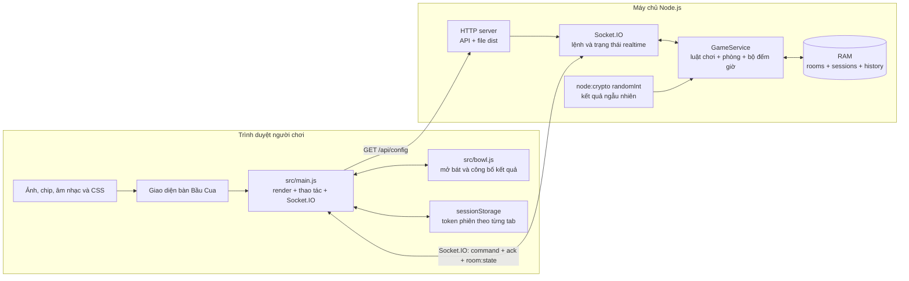
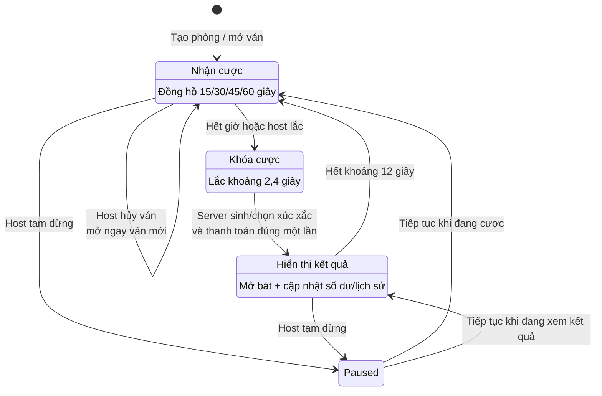
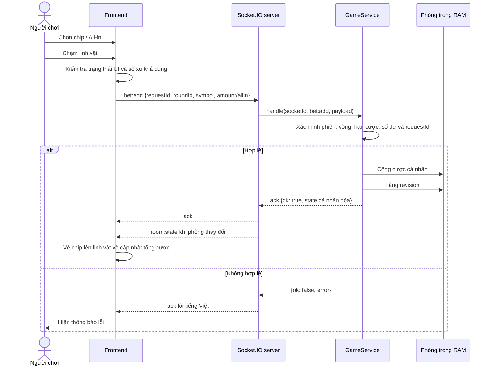
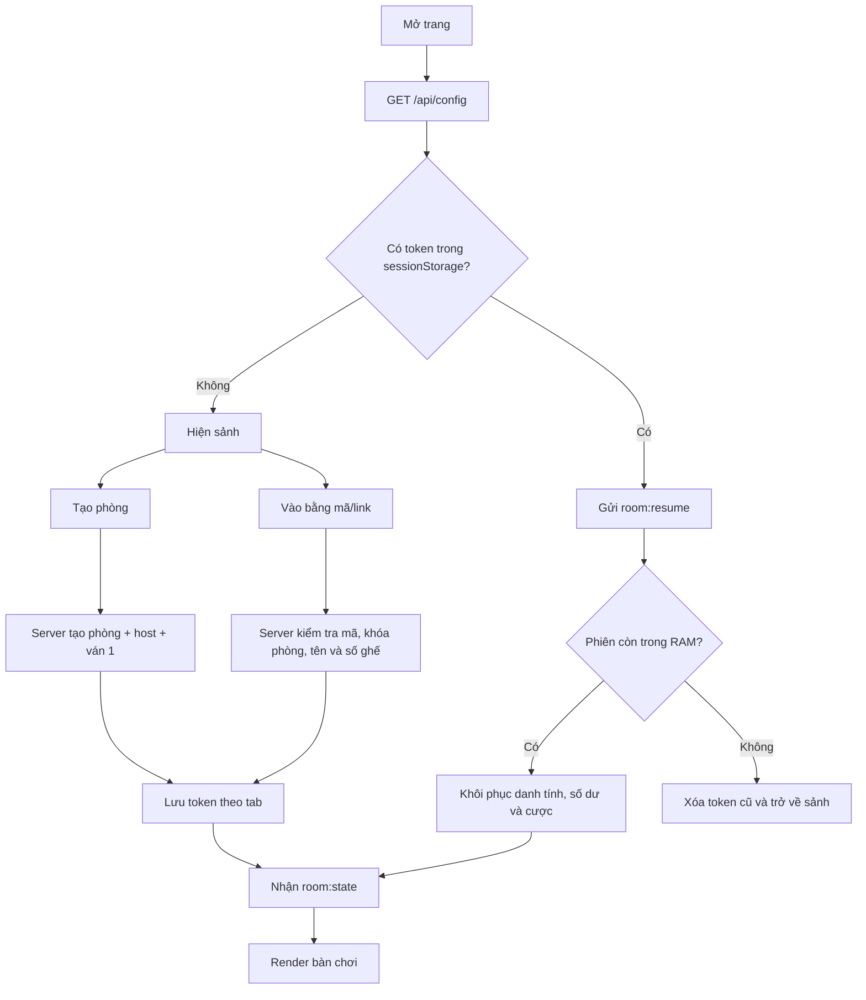

# Tổng hợp chức năng và sơ đồ hoạt động — Bầu Cua Victory

> Cập nhật theo mã nguồn hiện tại ngày 19/09/2026. Tài liệu này mô tả chức năng đã có, cách các phần phối hợp với nhau, giới hạn hiện tại và các điểm cần hoàn thiện.

## 1. Tổng quan dự án

Bầu Cua Victory là trò chơi Bầu Cua nhiều người chơi theo phòng, sử dụng xu ảo. Giao diện chạy trên trình duyệt máy tính và điện thoại; máy chủ Node.js giữ quyền quyết định đối với phòng, cược, xúc xắc, kết quả và số dư.

- Frontend: HTML, CSS, JavaScript ES modules và Vite.
- Realtime: Socket.IO client/server.
- Backend: Node.js HTTP server và `GameService` chạy trong bộ nhớ.
- Số người tối đa: 20 người/phòng, gồm cả chủ phòng.
- Sáu linh vật: Nai, Bầu, Gà, Cá, Cua, Tôm.
- Xu chỉ là xu ảo; không có nạp, rút hoặc đổi thưởng.

## 2. Sơ đồ kiến trúc tổng thể



Nguyên tắc quan trọng: frontend chỉ gửi yêu cầu và hiển thị snapshot; server mới là nguồn dữ liệu chính thức. Người chơi không thể tự sửa số dư hoặc tự quyết định kết quả chỉ bằng cách sửa giao diện.

## 3. Các chức năng đã triển khai

### 3.1. Sảnh và phòng chơi

- Nhập tên từ 2–24 ký tự.
- Tạo phòng mới và tự trở thành chủ phòng.
- Sinh mã phòng 6 ký tự.
- Vào phòng bằng mã hoặc liên kết mời có tham số `room`.
- Chặn tên trùng trong cùng phòng, không phân biệt chữ hoa/thường.
- Giới hạn tối đa 20 người/phòng.
- Hiển thị trạng thái kết nối và thông báo lỗi bằng tiếng Việt.
- Rời phòng khi không còn cược chưa chốt.
- Sao chép liên kết mời trong cửa sổ cài đặt.

### 3.2. Giao diện bàn chơi

| Khu vực | Nội dung hiện có |
|---|---|
| Header | Avatar, tên, số dư xu, nút cộng xu cho host, logo, toàn màn hình, âm thanh, luật chơi và cài đặt |
| Cột trái | Danh sách người chơi thật kết hợp các VIP mẫu, cấp VIP, avatar và số xu rút gọn |
| Cột phải | 20 ô lịch sử kết quả xúc xắc gần nhất và nút Thống kê |
| Sân khấu | Đồng hồ đếm ngược, thanh tiến trình, bát/đĩa, ba xúc xắc và trạng thái phiên |
| Bàn cược | Sáu vùng bấm khớp với linh vật có sẵn trên ảnh bàn nền |
| Thanh đáy | Chat, bộ chip, All-in, Xóa cược và Đặt cược |
| Hộp thoại | Mở bát, luật chơi, thống kê, cài đặt/quản trị và xác nhận đặt lại phòng |

### 3.3. Cược

- Chọn chip rồi chạm trực tiếp vào linh vật để đặt cược.
- Bộ chip giao diện hiện dùng: 1K, 5K, 10K, 50K và 100K.
- Nút All-in đặt toàn bộ số xu còn khả dụng vào linh vật được chọn.
- Mỗi linh vật hiển thị cược cá nhân và tổng cược toàn phòng.
- Chip ảnh được xếp chồng trên đúng vùng linh vật đã chọn.
- Xóa toàn bộ cược cá nhân khi phiên vẫn đang nhận cược.
- Server kiểm tra:
  - Đúng vòng hiện tại.
  - Vòng đang ở trạng thái nhận cược.
  - Người chơi đủ điều kiện tham gia.
  - Số cược là số nguyên dương.
  - Tổng cược không vượt số dư.
  - Không vượt giới hạn số học an toàn của phòng.
- Cược chỉ được trừ/thanh toán khi server chốt kết quả; trong lúc cược, server giữ giới hạn bằng tổng cược đang chờ.

### 3.4. Chu kỳ ván tự động

- Tạo phòng sẽ tự mở ván đầu tiên.
- Thời gian cược mặc định trong mã nguồn: 30 giây.
- Host có thể chọn 15, 30, 45 hoặc 60 giây cho các ván tiếp theo.
- Hết giờ, server khóa cược và chuyển sang hiệu ứng lắc.
- Thời gian lắc mặc định: 2,4 giây.
- Kết quả mặc định được giữ 12 giây trước khi tự mở ván tiếp theo.
- Ván không có người cược vẫn tự kết thúc và chuyển ván.
- Đồng hồ client dùng `serverNow` và `deadline`; server vẫn kiểm tra hạn cược khi nhận từng lệnh.

### 3.5. Bát, đĩa và xúc xắc

- Bát trên sân khấu che xúc xắc khi đang lắc và trước khi mở.
- Kết quả gồm ba linh vật chung cho toàn phòng.
- Hộp thoại mở bát hỗ trợ:
  - Kéo bát bằng chuột hoặc cảm ứng.
  - Thanh trượt nâng bát.
  - Nút mở bát nhanh.
  - Tự mở gần cuối thời gian kết quả để người chơi không bỏ lỡ phiên tiếp theo.
- Xúc xắc và kết quả thanh toán luôn lấy từ server; thao tác mở bát chỉ là phần trình bày.
- Ô linh vật thắng được đánh dấu sau khi bát đã mở.

### 3.6. Luật trả thưởng

Với số cược `C` vào một linh vật xuất hiện `k` lần:

- `k = 0`: nhận `0`, lỗ `C`.
- `k = 1`: nhận `2 × C`, lãi `C`.
- `k = 2`: nhận `3 × C`, lãi `2 × C`.
- `k = 3`: nhận `4 × C`, lãi `3 × C`.

Tiền nhận đã gồm tiền cược hoàn lại. Công thức server:

```text
Tổng nhận = Σ [cược linh vật × (số lần xuất hiện + 1)] với linh vật xuất hiện ít nhất một lần
Lãi/lỗ = Tổng nhận − Tổng cược
Số dư mới = Số dư cũ + Lãi/lỗ
```

### 3.7. Kết quả, lịch sử và thống kê người chơi

- Server lưu tối đa 20 ván gần nhất cho mỗi phòng.
- Mỗi lịch sử ván gồm ba xúc xắc, tổng cược, tổng trả và kết quả từng người có cược.
- Thống kê cá nhân gồm:
  - Số ván đã chơi.
  - Thắng, thua và hòa vốn.
  - Số dư cao nhất.
  - Tổng đã cược.
  - Tổng đã nhận.
- Số dư và kết quả cá nhân được che cho đến khi người chơi mở bát hoặc hệ thống tự mở.

### 3.8. Chức năng chủ phòng

| Chức năng | Cách hoạt động |
|---|---|
| Mở cược | Mở ván mới giữa các ván nếu cần thao tác thủ công |
| Lắc bát | Chốt sớm một ván đang nhận cược |
| Tạm dừng | Giữ thời gian còn lại và chặn cược mới; tiếp tục từ thời gian đã giữ |
| Khóa phòng | Chặn người chơi mới, không chặn phiên cũ kết nối lại |
| Chọn thời gian cược | Chọn 15/30/45/60 giây, áp dụng từ ván sau |
| Cấp xu | Cấp từ 1 đến 1 tỷ xu ảo/lần, trong giới hạn ví |
| Đuổi người | Thu hồi phiên hiện tại và đưa người chơi về sảnh |
| Chuyển host | Chuyển quyền cho một người chơi đang trực tuyến |
| Hủy ván | Hủy ván chưa lắc và giải phóng toàn bộ cược đang giữ |
| Chọn kết quả demo | Chọn ba linh vật cho một ván demo; lựa chọn chỉ gửi riêng cho host |
| Trả về ngẫu nhiên | Xóa kết quả demo đã chọn để server dùng `crypto.randomInt` |
| Đặt lại phòng | Xóa lịch sử/thống kê/cược, khôi phục số dư ban đầu và tạo `gameId` mới |

Nếu host mất kết nối, server chờ khoảng 5 giây rồi tự chuyển quyền cho người đang online. Việc lắc và thanh toán không phụ thuộc host còn kết nối hay không.

### 3.9. Âm thanh

- Nhạc nền Tết phát lặp sau tương tác đầu tiên của người dùng, phù hợp chính sách autoplay của trình duyệt.
- Tự tạm dừng nhạc khi tab bị ẩn.
- Nút bật/tắt âm thanh đổi icon tương ứng.
- Hiệu ứng âm thanh riêng cho đặt chip, lắc và thắng.

### 3.10. Toàn màn hình và điện thoại

- Giao diện sân khấu giữ tỉ lệ 16:9.
- Có màn hình nhắc xoay ngang trên điện thoại dọc.
- Hỗ trợ Fullscreen API chuẩn và các biến thể WebKit cũ.
- Thử khóa hướng ngang khi trình duyệt cho phép.
- Safari/iPhone không hỗ trợ khóa hướng sẽ dùng chế độ xoay toàn bộ bàn bằng CSS.
- Dùng `dvw/dvh` để thích ứng khi thanh địa chỉ di động hiện hoặc ẩn.
- Có manifest PWA với chế độ hiển thị fullscreen/standalone và hướng ngang.
- Người dùng iPhone có thể dùng “Chia sẻ → Thêm vào Màn hình chính” để ẩn thanh Safari tốt hơn.

### 3.11. Kết nối lại và đồng bộ

- Token phiên được lưu trong `sessionStorage`, riêng cho từng tab.
- Reload cùng tab có thể khôi phục đúng người chơi, số dư và cược.
- Socket.IO tự kết nối lại với thời gian chờ tăng dần.
- Sau khi nối lại, client xin snapshot mới thay vì tự phát lại thao tác cược chưa rõ kết quả.
- Một token được mở ở nơi mới sẽ thay thế socket cũ và vô hiệu quyền của kết nối cũ.
- Client bỏ qua snapshot có `revision` cũ hơn trạng thái hiện tại.

### 3.12. Bảo vệ phía server

- `requestId` chống xử lý lặp một thao tác làm cộng cược hai lần.
- `roundId` chặn lệnh của vòng cũ.
- `gameId` và `roundNumber` chặn lệnh quản trị hoặc reset bị trễ.
- Server xác minh quyền host từ phiên Socket.IO, không tin dữ liệu vai trò do client gửi.
- Giới hạn 100 sự kiện/10 giây/socket theo mặc định.
- Giới hạn payload Socket.IO 16 KB.
- Chỉ cho phép origin hợp lệ hoặc cùng origin.
- HTTP server ngăn truy cập file ngoài thư mục `dist` và chỉ phục vụ các MIME đã cho phép.
- Phiên đã ngắt được giữ khoảng 5 phút; phòng trống hết hạn khoảng 30 phút.
- Tối đa 100 phòng trong một tiến trình theo cấu hình mặc định của `GameService`.

## 4. Sơ đồ vòng đời một ván



## 5. Sơ đồ thao tác đặt cược và đồng bộ



## 6. Sơ đồ tạo phòng, vào phòng và khôi phục phiên



## 7. Giao thức realtime chính

### Client gửi lên server

- Phòng: `room:create`, `room:join`, `room:resume`, `room:sync`, `room:leave`.
- Ván: `round:open`, `round:shake`, `room:reset`.
- Cược: `bet:add`, `bet:clear`.
- Host: `host:pause`, `host:lock`, `host:betting-duration`, `host:grant`, `host:kick`, `host:transfer`, `host:cancel`, `host:result`.

### Server gửi về client

- `room:state`: snapshot đầy đủ nhưng được cá nhân hóa cho từng người.
- `room:kicked`: người chơi bị đưa về sảnh.
- `session:replaced`: phiên này đã được mở bởi kết nối mới.
- Acknowledgment cho mọi lệnh: `{ ok: true, state, session? }` hoặc `{ ok: false, error }`.

Server không gửi token vào broadcast và không gửi cược chi tiết của người khác; mọi người chỉ thấy tổng cược toàn bàn.

## 8. API HTTP

| Endpoint | Mục đích |
|---|---|
| `GET /api/config` | Trả cấu hình số dư, chip và sáu linh vật |
| `GET /api/state` | API tương thích cũ; không phải trạng thái multiplayer chính thức |
| `GET /api/health` | Trạng thái server, tổng số phòng và tổng phiên người chơi |
| `/socket.io` | Kết nối realtime và WebSocket |
| Các đường dẫn khác | Phục vụ frontend đã build trong `dist` |

## 9. Cấu trúc mã nguồn chính

| Đường dẫn | Trách nhiệm |
|---|---|
| `index.html` | Khung sảnh, bàn game, các nút và dialog |
| `src/main.js` | Tương tác UI, render trạng thái, Socket.IO, cược, âm thanh, fullscreen và quản trị |
| `src/bowl.js` | Logic trình bày mở bát, kéo/nâng bát và tự công bố |
| `src/arena.css` | Toàn bộ bố cục casino, responsive, chip, bàn, bát và chế độ ngang |
| `src/style.css` | Style nền tảng và một số thành phần dùng chung |
| `server/app.js` | HTTP API, static files, Socket.IO, rate limit và origin policy |
| `server/game.js` | Luật chơi, vòng đời phòng, cược, trả thưởng, phiên và quyền host |
| `game-config.json` | Số dư khởi tạo, chip cấu hình và danh sách linh vật |
| `public/assets/arena` | Background, logo, chip, bát/đĩa, xúc xắc và hình linh vật |
| `public/assets/audio` | Nhạc nền Tết |
| `public/manifest.webmanifest` | Cấu hình PWA/toàn màn hình/hướng ngang |
| `tests` | Test luật chơi, phòng tự động và multiplayer Socket.IO |
| `Dockerfile`, `render.yaml` | Đóng gói và triển khai một instance |

## 10. Triển khai và vận hành

### Chạy phát triển

```sh
# Terminal 1
npm run server

# Terminal 2
npm run dev
```

- Frontend phát triển: `http://localhost:5173`.
- Node/Socket.IO: `http://localhost:3000`.
- Vite proxy `/api` và `/socket.io` sang cổng 3000.

### Chạy bản production cục bộ

```sh
npm ci
npm run build
npm start
```

`npm start` build frontend rồi chạy một tiến trình Node phục vụ cả web, API và Socket.IO.

### Triển khai

- Có `render.yaml` cho Render, health check tại `/api/health`.
- Có Dockerfile hai giai đoạn để build frontend và chạy Node.js 24 Alpine.
- Kiến trúc hiện tại phải chạy một instance vì toàn bộ phòng nằm trong RAM.

## 11. Trạng thái kiểm thử hiện tại

- `npm run build`: đạt.
- `npm test`: 18 test, hiện đạt 9 và lỗi 9.
- Nguyên nhân chính của các test lỗi: `game-config.json` đang đặt số dư ban đầu là `100000`, trong khi nhiều assertion cũ vẫn mong đợi `1000`. Một test giả mạo số cược cũng dựa trên giới hạn số dư cũ nên không còn đúng với cấu hình mới.
- Cần cập nhật test theo số dư mới hoặc đưa cấu hình về giá trị cũ trước khi xem bộ test là xanh hoàn toàn.

## 12. Các phần đang là mô phỏng hoặc chưa hoàn thiện

1. Nút Chat đã có trên giao diện nhưng chưa có logic gửi/nhận tin nhắn.
2. Popup Thống kê linh vật đang sinh phần trăm ngẫu nhiên 15–19%; chưa tính từ lịch sử thật.
3. Danh sách VIP có thêm người chơi mẫu để trang trí khi phòng ít người; đây không phải người thật.
4. Số online trên giao diện đang hiển thị tối thiểu 123 để tạo cảm giác đông; không phản ánh chính xác số kết nối thật.
5. `game-config.json` có bốn chip `10, 50, 100, 500`, nhưng frontend yêu cầu đúng năm chip mới dùng cấu hình; vì vậy hiện tự chuyển sang bộ mặc định `1K, 5K, 10K, 50K, 100K`.
6. README/tài liệu cũ ghi kết quả hiển thị 5 giây, trong khi mã server hiện dùng 12 giây.
7. Manifest PWA đã có nhưng chưa có service worker, nên chưa hỗ trợ chơi offline.
8. Chưa có tài khoản, mật khẩu, cơ sở dữ liệu, lịch sử lâu dài hoặc đồng bộ nhiều server.
9. Restart, redeploy hoặc server ngủ sẽ xóa toàn bộ phòng, phiên và lịch sử đang nằm trong RAM.
10. Kết quả ngẫu nhiên dùng `crypto.randomInt`, nhưng chưa có cơ chế kiểm toán độc lập hoặc provably fair.

## 13. Thứ tự nên hoàn thiện tiếp

1. Đồng bộ `initialBalance`, danh sách chip, README và toàn bộ test.
2. Thay thống kê ngẫu nhiên bằng thống kê thực từ `room.history`.
3. Hiển thị đúng số người online và phân biệt rõ VIP mẫu nếu vẫn muốn giữ phần trang trí.
4. Xây dựng chat realtime hoặc ẩn nút Chat cho tới khi có chức năng.
5. Kiểm thử thực tế trên iPhone Safari, Android Chrome và màn hình desktop phổ biến.
6. Thêm cơ sở dữ liệu/Redis nếu cần lưu lâu dài hoặc chạy nhiều instance.
7. Thêm giám sát lỗi, log có cấu trúc và đo tải trước khi mở cho nhiều phòng công khai.

## 14. Tóm tắt luồng hoạt động

```mermaid
flowchart LR
    A[Tạo/vào phòng] --> B[Nhận snapshot cá nhân]
    B --> C[Chọn chip]
    C --> D[Chạm linh vật]
    D --> E[Server xác minh và ghi cược]
    E --> F[Hết giờ / host lắc]
    F --> G[Server sinh 3 kết quả]
    G --> H[Tính tiền đúng một lần]
    H --> I[Phát room:state cho từng người]
    I --> J[Mở bát và hiện kết quả]
    J --> K[Cập nhật số dư, thống kê, lịch sử]
    K --> L[Tự mở ván tiếp theo]
    L --> C
```



