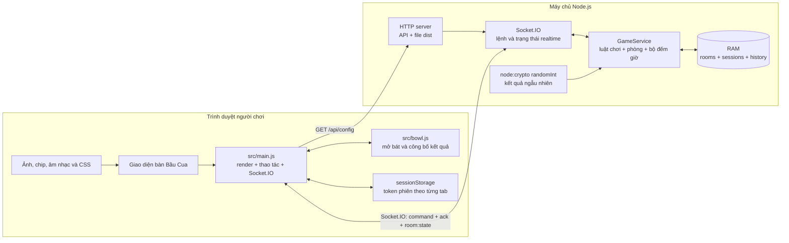
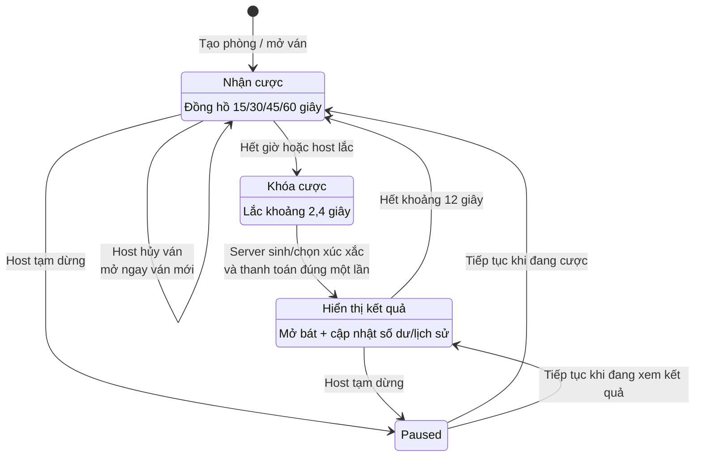
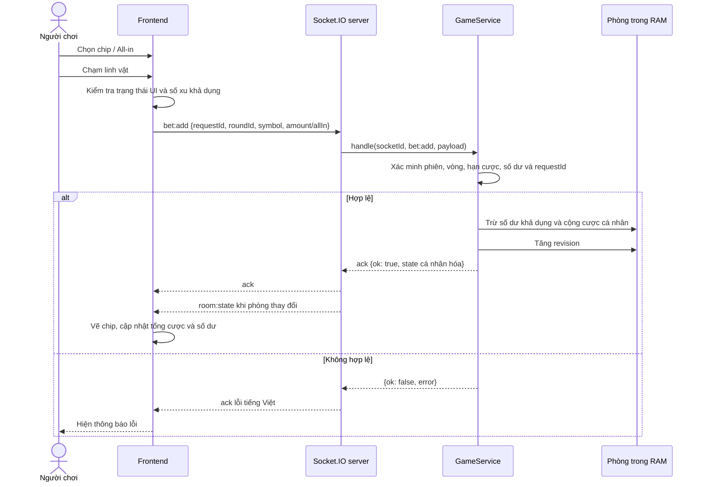
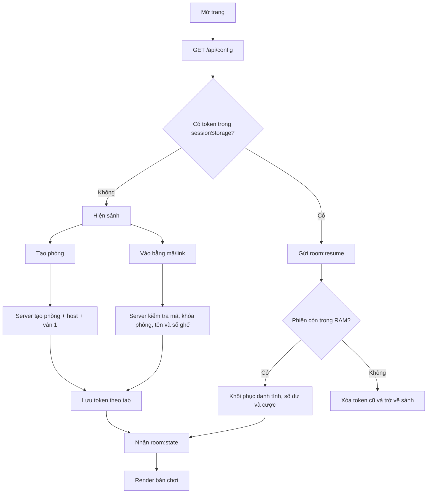
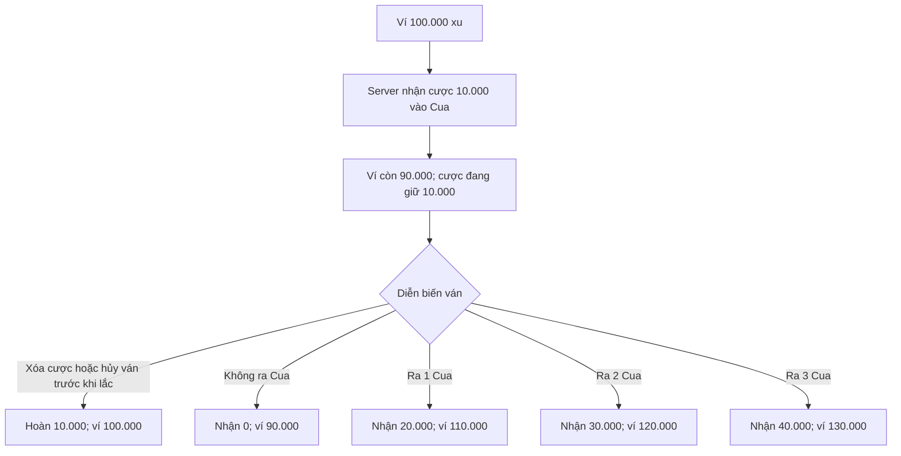

# Tổng hợp chức năng và sơ đồ hoạt động — Bầu Cua Victory

> Cập nhật theo mã nguồn ngày 21/09/2026. `npm test` chạy lại ngày này: 18/18 đạt. Các thay đổi được mô tả là đã có trong mã nguồn; không đồng nghĩa đã kiểm chứng trên mọi điện thoại hay trên máy chủ Internet. Kế hoạch nâng cấp và tiêu chí nghiệm thu ở mục 13–16.

## 1. Tổng quan dự án

Bầu Cua Victory là trò chơi Bầu Cua nhiều người chơi theo phòng, sử dụng xu ảo. Giao diện chạy trên trình duyệt máy tính và điện thoại; máy chủ Node.js giữ quyền quyết định đối với phòng, cược, xúc xắc, kết quả và số dư.

- Frontend: HTML, CSS, JavaScript ES modules và Vite.
- Realtime: Socket.IO client/server.
- Backend: Node.js HTTP server và `GameService` chạy trong bộ nhớ.
- Số người tối đa: 20 người/phòng, gồm cả chủ phòng.
- Sáu linh vật: Nai, Bầu, Gà, Cá, Cua, Tôm.
- Xu chỉ là xu ảo; không có nạp, rút hoặc đổi thưởng.

## 2. Sơ đồ kiến trúc tổng thể


```mermaid
flowchart LR
    subgraph CLIENT[Trình duyệt người chơi]
        UI[Giao diện bàn Bầu Cua]
        MAIN[src/main.js<br/>render + thao tác + Socket.IO]
        BOWL[src/bowl.js<br/>mở bát và công bố kết quả]
        STORE[sessionStorage<br/>token phiên theo từng tab]
        ASSET[Ảnh, chip, âm nhạc và CSS]
        UI --> MAIN
        MAIN <--> BOWL
        MAIN <--> STORE
        ASSET --> UI
    end

    subgraph SERVER[Máy chủ Node.js]
        HTTP[HTTP server<br/>API + file dist]
        SOCKET[Socket.IO<br/>lệnh và trạng thái realtime]
        GAME[GameService<br/>luật chơi + phòng + bộ đếm giờ]
        MEMORY[(RAM<br/>rooms + sessions + history)]
        RNG[node:crypto randomInt<br/>kết quả ngẫu nhiên]
        HTTP --> SOCKET
        SOCKET <--> GAME
        GAME <--> MEMORY
        RNG --> GAME
    end

    MAIN <-->|Socket.IO: command + ack + room:state| SOCKET
    MAIN -->|GET /api/config| HTTP
```

Nguyên tắc quan trọng: frontend chỉ gửi yêu cầu và hiển thị snapshot; server mới là nguồn dữ liệu chính thức. Người chơi không thể tự sửa số dư hoặc tự quyết định kết quả chỉ bằng cách sửa giao diện.

## 3. Các chức năng đã triển khai

### 3.1. Sảnh và phòng chơi

- Nhập tên từ 2–24 ký tự.
- Tạo phòng mới và tự trở thành chủ phòng.
- Sinh mã phòng 6 ký tự.
- Vào phòng bằng mã hoặc liên kết mời có tham số `room`.
- Chặn tên trùng trong cùng phòng, không phân biệt chữ hoa/thường.
- Giới hạn tối đa 20 người/phòng.
- Hiển thị trạng thái kết nối và thông báo lỗi bằng tiếng Việt.
- Rời phòng khi không còn cược chưa chốt.
- Sao chép liên kết mời trong cửa sổ cài đặt.

### 3.2. Giao diện bàn chơi

| Khu vực | Nội dung hiện có |
|---|---|
| Header | Avatar, tên, số dư xu, nút cộng xu cho host, logo, toàn màn hình, âm thanh, luật chơi và cài đặt |
| Cột trái | Danh sách người chơi thật kết hợp các VIP mẫu, cấp VIP, avatar và số xu rút gọn |
| Cột phải | 20 ô lịch sử kết quả xúc xắc gần nhất và nút Thống kê |
| Sân khấu | Đồng hồ đếm ngược, thanh tiến trình và trạng thái phiên; bát/đĩa hiện trên lớp phủ giữa màn hình khi khóa cược |
| Bàn cược | Sáu vùng bấm khớp với linh vật có sẵn trên ảnh bàn nền |
| Thanh đáy | Chat, bộ chip, All-in, Xóa cược và Đặt cược |
| Hộp thoại/lớp phủ | Mở bát kéo 360°, luật chơi, thống kê, cài đặt/quản trị và xác nhận đặt lại phòng |

### 3.3. Cược

- Chọn chip rồi chạm trực tiếp vào linh vật để đặt cược.
- Bộ chip giao diện hiện dùng: 1K, 5K, 10K, 50K, 100K, 500K; tiếp theo là ALL IN. Ảnh chip được ánh xạ theo mệnh giá.
- Số dư khởi tạo vẫn là 100.000 xu; muốn cược 500K cần thắng thêm hoặc được host cấp xu.
- Nút All-in đặt toàn bộ số xu còn khả dụng vào linh vật được chọn.
- Mỗi linh vật hiển thị cược cá nhân và tổng cược toàn phòng.
- Chip ảnh được xếp chồng trên đúng vùng linh vật đã chọn.
- Xóa toàn bộ cược cá nhân khi phiên vẫn đang nhận cược.
- Server kiểm tra:
  - Đúng vòng hiện tại.
  - Vòng đang ở trạng thái nhận cược.
  - Người chơi đủ điều kiện tham gia.
  - Số cược là số nguyên dương.
  - Cược mới không vượt số dư khả dụng.
  - Không vượt giới hạn số học an toàn của phòng.
- Server trừ tiền ngay khi chấp nhận `bet:add` rồi gửi số dư mới cho người chơi. Chọn chip đơn thuần chưa đặt cược; chạm linh thú mới gửi lệnh.
- Xóa cược cá nhân hoặc host hủy ván chưa lắc sẽ hoàn toàn bộ tiền đã cược tương ứng.
- `balanceMode: available` cho biết server gửi ví đã trừ cược. Giao diện có lớp tương thích với server cũ; cần đồng bộ phiên bản frontend/backend khi vận hành.

### 3.4. Chu kỳ ván tự động

- Tạo phòng sẽ tự mở ván đầu tiên.
- Thời gian cược mặc định trong mã nguồn: 30 giây.
- Host có thể chọn 15, 30, 45 hoặc 60 giây cho các ván tiếp theo.
- Hết giờ, server khóa cược và chuyển sang hiệu ứng lắc.
- Thời gian lắc mặc định: 2,4 giây.
- Kết quả mặc định được giữ 12 giây trước khi tự mở ván tiếp theo.
- Ván không có người cược vẫn tự kết thúc và chuyển ván.
- Đồng hồ client dùng `serverNow` và `deadline`; server vẫn kiểm tra hạn cược khi nhận từng lệnh.

### 3.5. Bát, đĩa và xúc xắc

- Lớp mở bát ở giữa màn hình làm mờ nền phía sau, dùng đĩa `bowl-tray1.png` và ảnh bát `bowl-tray2.png`.
- Kết quả gồm ba linh vật chung cho toàn phòng.
- Lớp mở bát hỗ trợ:
  - Đĩa cố định, bát trượt trên/dưới/trái/phải và theo các hướng chéo bằng chuột hoặc cảm ứng.
  - Ghi nhận điểm chạm ban đầu và giữ pointer để kéo từ từ; đã bổ sung CSS tránh bát nhảy khi nhấn giữ.
  - Thả trước ngưỡng mở thì bát trở về; qua ngưỡng thì hoàn tất mở. Bàn phím có thể kích hoạt mở.
  - Tự mở gần cuối thời gian kết quả để người chơi không bỏ lỡ phiên tiếp theo.
- Xúc xắc và kết quả thanh toán luôn lấy từ server; thao tác mở bát chỉ là phần trình bày.
- Ô linh vật thắng được đánh dấu sau khi bát đã mở.

### 3.6. Luật trả thưởng

Với số cược `C` vào một linh vật xuất hiện `k` lần:

- `k = 0`: nhận `0`, lỗ `C`.
- `k = 1`: nhận `2 × C`, lãi `C`.
- `k = 2`: nhận `3 × C`, lãi `2 × C`.
- `k = 3`: nhận `4 × C`, lãi `3 × C`.

Tiền nhận đã gồm tiền cược hoàn lại. Công thức server:

```text
Tổng nhận = Σ [cược linh vật × (số lần xuất hiện + 1)] với linh vật xuất hiện ít nhất một lần
Lãi/lỗ = Tổng nhận − Tổng cược
Khi cược: Số dư khả dụng = Số dư trước cược − Tổng cược
Khi chốt: Số dư cuối = Số dư khả dụng + Tổng nhận
Tương đương: Số dư cuối = Số dư trước cược + Lãi/lỗ
```

### 3.7. Kết quả, lịch sử và thống kê người chơi

- Server lưu tối đa 20 ván gần nhất cho mỗi phòng.
- Mỗi lịch sử ván gồm ba xúc xắc, tổng cược, tổng trả và kết quả từng người có cược.
- Thống kê cá nhân gồm:
  - Số ván đã chơi.
  - Thắng, thua và hòa vốn.
  - Số dư cao nhất.
  - Tổng đã cược.
  - Tổng đã nhận.
- Số dư và kết quả cá nhân được che cho đến khi người chơi mở bát hoặc hệ thống tự mở.

### 3.8. Chức năng chủ phòng

| Chức năng | Cách hoạt động |
|---|---|
| Mở cược | Mở ván mới giữa các ván nếu cần thao tác thủ công |
| Lắc bát | Chốt sớm một ván đang nhận cược |
| Tạm dừng | Giữ thời gian còn lại và chặn cược mới; tiếp tục từ thời gian đã giữ |
| Khóa phòng | Chặn người chơi mới, không chặn phiên cũ kết nối lại |
| Chọn thời gian cược | Chọn 15/30/45/60 giây, áp dụng từ ván sau |
| Cấp xu | Cấp từ 1 đến 1 tỷ xu ảo/lần, trong giới hạn ví |
| Đuổi người | Thu hồi phiên hiện tại và đưa người chơi về sảnh |
| Chuyển host | Chuyển quyền cho một người chơi đang trực tuyến |
| Hủy ván | Hủy ván chưa lắc và giải phóng toàn bộ cược đang giữ |
| Chọn kết quả demo | Chọn ba linh vật cho một ván demo; lựa chọn chỉ gửi riêng cho host |
| Trả về ngẫu nhiên | Xóa kết quả demo đã chọn để server dùng `crypto.randomInt` |
| Đặt lại phòng | Xóa lịch sử/thống kê/cược, khôi phục số dư ban đầu và tạo `gameId` mới |

Nếu host mất kết nối, server chờ khoảng 5 giây rồi tự chuyển quyền cho người đang online. Việc lắc và thanh toán không phụ thuộc host còn kết nối hay không.

### 3.9. Âm thanh

- Nhạc nền Tết phát lặp sau tương tác đầu tiên của người dùng, phù hợp chính sách autoplay của trình duyệt.
- Tự tạm dừng nhạc khi tab bị ẩn.
- Nút bật/tắt âm thanh đổi icon tương ứng.
- Hiệu ứng âm thanh riêng cho đặt chip, lắc và thắng.

### 3.10. Toàn màn hình và điện thoại

- Giao diện sân khấu giữ tỉ lệ 16:9.
- Chế độ fullscreen cũng giữ 16:9; phần màn hình dư được lấp bằng background mờ, không ép bàn giãn theo màn hình điện thoại.
- Logo `logo1.png` giữ điểm neo trên tay nhân vật, có kích thước thích ứng và animation lên/xuống trong CSS.
- Có màn hình nhắc xoay ngang trên điện thoại dọc.
- Hỗ trợ Fullscreen API chuẩn và các biến thể WebKit cũ.
- Thử khóa hướng ngang khi trình duyệt cho phép.
- Safari/iPhone không hỗ trợ khóa hướng sẽ dùng chế độ xoay toàn bộ bàn bằng CSS.
- Dùng `dvw/dvh` để thích ứng khi thanh địa chỉ di động hiện hoặc ẩn.
- Có manifest PWA với chế độ hiển thị fullscreen/standalone và hướng ngang.
- Người dùng iPhone có thể dùng “Chia sẻ → Thêm vào Màn hình chính” để ẩn thanh Safari tốt hơn.

### 3.11. Kết nối lại và đồng bộ

- Token phiên được lưu trong `sessionStorage`, riêng cho từng tab.
- Reload cùng tab có thể khôi phục đúng người chơi, số dư và cược.
- Socket.IO tự kết nối lại với thời gian chờ tăng dần.
- Sau khi nối lại, client xin snapshot mới thay vì tự phát lại thao tác cược chưa rõ kết quả.
- Một token được mở ở nơi mới sẽ thay thế socket cũ và vô hiệu quyền của kết nối cũ.
- Client bỏ qua snapshot có `revision` cũ hơn trạng thái hiện tại.

### 3.12. Bảo vệ phía server

- `requestId` chống xử lý lặp một thao tác làm cộng cược hai lần.
- `roundId` chặn lệnh của vòng cũ.
- `gameId` và `roundNumber` chặn lệnh quản trị hoặc reset bị trễ.
- Server xác minh quyền host từ phiên Socket.IO, không tin dữ liệu vai trò do client gửi.
- Giới hạn 100 sự kiện/10 giây/socket theo mặc định.
- Giới hạn payload Socket.IO 16 KB.
- Chỉ cho phép origin hợp lệ hoặc cùng origin.
- HTTP server ngăn truy cập file ngoài thư mục `dist` và chỉ phục vụ các MIME đã cho phép.
- Phiên đã ngắt được giữ khoảng 5 phút; phòng trống hết hạn khoảng 30 phút.
- Tối đa 100 phòng trong một tiến trình theo cấu hình mặc định của `GameService`.

## 4. Sơ đồ vòng đời một ván


```mermaid
stateDiagram-v2
    [*] --> Betting: Tạo phòng / mở ván
    Betting: Nhận cược
    Betting: Đồng hồ 15/30/45/60 giây
    Betting --> Revealing: Hết giờ hoặc host lắc
    Betting --> Betting: Host hủy ván<br/>mở ngay ván mới
    Revealing: Khóa cược
    Revealing: Lắc khoảng 2,4 giây
    Revealing --> Result: Server sinh/chọn xúc xắc<br/>và thanh toán đúng một lần
    Result: Hiển thị kết quả
    Result: Mở bát + cập nhật số dư/lịch sử
    Result --> Betting: Hết khoảng 12 giây
    Betting --> Paused: Host tạm dừng
    Result --> Paused: Host tạm dừng
    Paused --> Betting: Tiếp tục khi đang cược
    Paused --> Result: Tiếp tục khi đang xem kết quả
```

## 5. Sơ đồ thao tác đặt cược và đồng bộ


```mermaid
sequenceDiagram
    actor P as Người chơi
    participant C as Frontend
    participant S as Socket.IO server
    participant G as GameService
    participant R as Phòng trong RAM

    P->>C: Chọn chip / All-in
    P->>C: Chạm linh vật
    C->>C: Kiểm tra trạng thái UI và số xu khả dụng
    C->>S: bet:add {requestId, roundId, symbol, amount/allIn}
    S->>G: handle(socketId, bet:add, payload)
    G->>G: Xác minh phiên, vòng, hạn cược, số dư và requestId
    alt Hợp lệ
        G->>R: Trừ số dư khả dụng và cộng cược cá nhân
        G->>R: Tăng revision
        G-->>S: ack {ok: true, state cá nhân hóa}
        S-->>C: ack
        S-->>C: room:state khi phòng thay đổi
        C->>C: Vẽ chip, cập nhật tổng cược và số dư
    else Không hợp lệ
        G-->>S: {ok: false, error}
        S-->>C: ack lỗi tiếng Việt
        C-->>P: Hiện thông báo lỗi
    end
```

## 6. Sơ đồ tạo phòng, vào phòng và khôi phục phiên


```mermaid
flowchart TD
    A[Mở trang] --> B[GET /api/config]
    B --> C{Có token trong sessionStorage?}
    C -- Không --> D[Hiện sảnh]
    D --> E[Tạo phòng]
    D --> F[Vào bằng mã/link]
    E --> G[Server tạo phòng + host + ván 1]
    F --> H[Server kiểm tra mã, khóa phòng, tên và số ghế]
    G --> I[Lưu token theo tab]
    H --> I
    C -- Có --> J[Gửi room:resume]
    J --> K{Phiên còn trong RAM?}
    K -- Có --> L[Khôi phục danh tính, số dư và cược]
    K -- Không --> M[Xóa token cũ và trở về sảnh]
    I --> N[Nhận room:state]
    L --> N
    N --> O[Render bàn chơi]
```

## 7. Giao thức realtime chính

### Client gửi lên server

- Phòng: `room:create`, `room:join`, `room:resume`, `room:sync`, `room:leave`.
- Ván: `round:open`, `round:shake`, `room:reset`.
- Cược: `bet:add`, `bet:clear`.
- Host: `host:pause`, `host:lock`, `host:betting-duration`, `host:grant`, `host:kick`, `host:transfer`, `host:cancel`, `host:result`.

### Server gửi về client

- `room:state`: snapshot đầy đủ nhưng được cá nhân hóa cho từng người.
- `room:kicked`: người chơi bị đưa về sảnh.
- `session:replaced`: phiên này đã được mở bởi kết nối mới.
- Acknowledgment cho mọi lệnh: `{ ok: true, state, session? }` hoặc `{ ok: false, error }`.

Server không gửi token vào broadcast và không gửi phân bố cược theo từng linh vật của người khác. Snapshot có tổng cược của từng người, tổng cược toàn bàn và lịch sử kết quả thanh toán.

## 8. API HTTP

| Endpoint | Mục đích |
|---|---|
| `GET /api/config` | Trả cấu hình số dư, chip và sáu linh vật |
| `GET /api/state` | API tương thích cũ; không phải trạng thái multiplayer chính thức |
| `GET /api/health` | Trạng thái server, tổng số phòng và tổng phiên người chơi |
| `/socket.io` | Kết nối realtime và WebSocket |
| Các đường dẫn khác | Phục vụ frontend đã build trong `dist` |

## 9. Cấu trúc mã nguồn chính

| Đường dẫn | Trách nhiệm |
|---|---|
| `index.html` | Khung sảnh, bàn game, các nút và dialog |
| `src/main.js` | Tương tác UI, render trạng thái, Socket.IO, cược, âm thanh, fullscreen và quản trị |
| `src/bowl.js` | Logic lớp phủ mở bát, kéo bát 360° và tự công bố |
| `src/arena.css` | Toàn bộ bố cục casino, responsive, chip, bàn, bát và chế độ ngang |
| `src/style.css` | Style nền tảng và một số thành phần dùng chung |
| `server/app.js` | HTTP API, static files, Socket.IO, rate limit và origin policy |
| `server/game.js` | Luật chơi, vòng đời phòng, cược, trả thưởng, phiên và quyền host |
| `game-config.json` | Số dư khởi tạo, chip cấu hình và danh sách linh vật |
| `public/assets/arena` | Background, logo, chip, bát/đĩa, xúc xắc và hình linh vật |
| `public/assets/audio` | Nhạc nền Tết |
| `public/manifest.webmanifest` | Cấu hình PWA/toàn màn hình/hướng ngang |
| `tests` | Test luật chơi, phòng tự động và multiplayer Socket.IO |
| `Dockerfile`, `render.yaml` | Đóng gói và triển khai một instance |

## 10. Triển khai và vận hành

### Chạy phát triển

```sh
# Terminal 1
npm run server

# Terminal 2
npm run dev
```

- Frontend phát triển: `http://localhost:5173`.
- Node/Socket.IO: `http://localhost:3000`.
- Vite proxy `/api` và `/socket.io` sang cổng 3000.

### Chạy bản production cục bộ

```sh
npm ci
npm run build
npm start
```

`npm start` build frontend rồi chạy một tiến trình Node phục vụ cả web, API và Socket.IO.

### Triển khai

- Có `render.yaml` cho Render, health check tại `/api/health`.
- Có Dockerfile hai giai đoạn để build frontend và chạy Node.js 24 Alpine.
- Kiến trúc hiện tại phải chạy một instance vì toàn bộ phòng nằm trong RAM.

## 11. Trạng thái kiểm thử hiện tại

- `npm test` ngày 21/09/2026: **18/18 đạt**, gồm luật trả thưởng, phòng tự động, phân quyền, kết nối lại và 20 kết nối Socket.IO.
- Các assertion về ví ban đầu đã cập nhật theo cấu hình; test chip được cấp đủ xu để kiểm tra cả 500K.
- Bản build ở lần sửa fullscreen trước đã thành công. Lần tổng hợp này không thay đổi mã chạy game.
- Các test hiện tại chủ yếu kiểm tra server; chưa chứng minh mọi thao tác kéo bát, khay chip và fullscreen trên Safari iPhone thật.
- Ảnh kiểm tra 852×393 ở lần trước chỉ chụp sảnh. Sảnh có phần trên/dưới bị cắt trong ảnh, nên cần nghiệm thu thêm chiều cao form; chưa thể coi đó là bằng chứng toàn bộ bàn cược đã đạt trên điện thoại.

## 12. Các phần đang là mô phỏng hoặc chưa hoàn thiện

1. Nút Chat đã có trên giao diện nhưng chưa có logic gửi/nhận tin nhắn.
2. Popup Thống kê linh vật đang sinh phần trăm ngẫu nhiên 15–19%; chưa tính từ lịch sử thật.
3. Danh sách VIP có thêm người chơi mẫu để trang trí khi phòng ít người; đây không phải người thật.
4. Số online trên giao diện đang hiển thị tối thiểu 123 để tạo cảm giác đông; không phản ánh chính xác số kết nối thật.
5. Nút “ĐẶT CƯỢC” hiện chỉ phát âm thanh và thông báo, không gửi một lệnh xác nhận mới. Cược thực được gửi khi chạm linh thú; cần làm rõ hành vi để tránh báo thành công khi chưa có cược.
6. README/tài liệu cũ ghi kết quả hiển thị 5 giây, trong khi mã server hiện dùng 12 giây.
7. Manifest PWA đã có nhưng chưa có service worker để cache giao diện. Trò chơi nhiều người vẫn cần kết nối server, kể cả khi bổ sung cache offline.
8. Chưa có tài khoản, mật khẩu, cơ sở dữ liệu, lịch sử lâu dài hoặc đồng bộ nhiều server.
9. Restart, redeploy hoặc server ngủ sẽ xóa toàn bộ phòng, phiên và lịch sử đang nằm trong RAM.
10. Kết quả ngẫu nhiên dùng `crypto.randomInt`, nhưng chưa có cơ chế kiểm toán độc lập hoặc provably fair.
11. Host có thể chọn kết quả demo áp dụng cho cả phòng; cờ demo bị loại khỏi lịch sử gửi cho khách. Cần tách chế độ demo và công khai nhãn để người chơi hiểu đúng.
12. Server lưu lịch sử mới nhất ở đầu (`unshift`), nhưng giao diện trải phẳng rồi lấy `slice(-20)`. Khi đủ nhiều ván, phần hiển thị có thể lấy các kết quả cũ thay vì mới nhất.
13. Lớp tương thích server cũ trừ tổng cược cả khi đã ở pha kết quả; cần giới hạn theo pha để tránh hiển thị trừ hai lần sau thanh toán trên server cũ.
14. Host có thể đuổi người đang có cược ở pha betting; cần quy định rõ hoàn cược hoặc giữ người đó để thanh toán trước khi thu hồi phiên.
15. Snapshot kết quả đã chứa xúc xắc và thanh toán trước khi mỗi người kéo bát. Che bát chỉ là hiệu ứng trình bày, không phải biện pháp bảo mật kết quả.
16. Kiểm kê ngày 21/09/2026: 64 file trong `public/assets`, tổng 66.511.546 byte (khoảng 63,4 MiB). Đây là tổng tài nguyên trên đĩa, không phải dung lượng tải đầu trang; cần đo request thực tế trước khi tối ưu.

## 13. Kế hoạch ưu tiên để nâng chất lượng và điểm đánh giá

Chưa có rubric của giảng viên, nên chưa thể dự đoán hoặc cam kết điểm. Ưu tiên dưới đây dựa trên tính đúng đắn, trải nghiệm, kiến trúc và bằng chứng kiểm thử. Đây là kế hoạch đề xuất, chưa được triển khai trong lần tổng hợp này.

| Mức | Công việc | Tiêu chí nghiệm thu |
|---|---|---|
| P0 — làm trước | Đồng bộ phiên bản web/server; có thông tin phiên bản tại health check; xử lý đúng ví server cũ theo pha | Không còn bộ chip cũ; cược, hoàn cược và trả thưởng trên hai thiết bị khớp nhau; reload không trừ lặp |
| P0 | Làm rõ nút ĐẶT CƯỢC theo cơ chế chạm linh thú gửi ngay; thông báo thành công chỉ dựa trên phản hồi server | Chưa cược, mất mạng hoặc server từ chối đều không hiện “đã ghi nhận” |
| P0 | Thống kê thật, số online thật, nhãn VIP mô phỏng rõ; sửa thứ tự lịch sử | Đối chiếu được số lần mỗi linh thú với dữ liệu ván; ván mới nhất xuất hiện đúng vị trí |
| P0 | Tách phòng demo và phòng chơi ngẫu nhiên; quy định xử lý người bị đuổi khi còn cược | Cả phòng thấy nhãn demo trước khi cược; phòng thường từ chối lệnh ép kết quả; không mất cược do thu hồi phiên |
| P1 — hoàn thiện trải nghiệm | Nghiệm thu sảnh, fullscreen, khay 6 chip + ALL IN và kéo bát trên thiết bị thật | iPhone Safari và Android Chrome dùng được cả dọc/ngang; form không bị cắt; chip/vòng chọn khớp linh thú |
| P1 | Chat realtime có giới hạn độ dài, chống spam và hiển thị văn bản an toàn; hoặc ẩn nút khi chưa làm | Hai người gửi/nhận đúng phòng; nội dung nhập không trở thành HTML thực thi |
| P1 | Tối ưu ảnh theo kích thước dùng thực tế, đo tải mạng và chuyển động | Giữ độ nét/alpha; ghi nhận tải trước/sau và độ trễ thao tác trên cùng thiết bị, cùng mạng |
| P1 | Kiểm thử trình duyệt và tình huống mạng | Cược → trừ xu → xóa/hoàn; ALL IN; hết giờ; reconnect; kéo bát; đổi hướng đều có bằng chứng |
| P2 — giá trị kiến trúc | Lưu phòng, ván và sổ giao dịch xu vào cơ sở dữ liệu; mỗi lệnh có khóa chống lặp | Restart phục hồi dữ liệu; một cược/một lần trả chỉ ghi một lần; xử lý ván dở theo quy tắc đã công bố |
| P2 | Tách module cấu hình, cược, lịch sử, quản trị và hiển thị khỏi `main.js` | Các phần có trách nhiệm rõ, giữ nguyên hành vi và qua kiểm thử |
| P2 | CI chạy test/build; log lỗi có cấu trúc, health check, cấu hình môi trường và hướng dẫn triển khai | Cài từ bản checkout sạch chạy được; lỗi truy được theo phòng/ván mà không ghi token bí mật |
| P3 — trước buổi bảo vệ | Đồng bộ README, giao thức, sơ đồ, kết quả test và kịch bản demo | Không còn mô tả 5 giây, chip cũ, thanh nâng bát hoặc trả tiền cuối ván sai với bản demo |

Không cần thêm tài khoản, bảng xếp hạng toàn hệ thống hay chạy nhiều server ngay nếu rubric không yêu cầu. Hoàn thiện P0/P1 trước giúp phần trình diễn đáng tin cậy hơn.

## 14. Tóm tắt luồng hoạt động


```mermaid
flowchart LR
    A[Tạo/vào phòng] --> B[Nhận snapshot cá nhân]
    B --> C[Chọn chip]
    C --> D[Chạm linh vật]
    D --> E[Server xác minh, trừ ví và ghi cược]
    E --> F[Hết giờ / host lắc]
    F --> G[Server sinh 3 kết quả]
    G --> H[Cộng tổng nhận đúng một lần]
    H --> I[Phát room:state cho từng người]
    I --> J[Mở bát và hiện kết quả]
    J --> K[Cập nhật số dư, thống kê, lịch sử]
    K --> L[Tự mở ván tiếp theo]
    L --> C
```

## 15. Sơ đồ cơ chế tiền hiện tại

Ví dụ ví có 100.000 xu, cược 10.000 xu vào Cua:


```mermaid
flowchart TD
    A[Ví 100.000 xu] --> B[Server nhận cược 10.000 vào Cua]
    B --> C[Ví còn 90.000; cược đang giữ 10.000]
    C --> D{Diễn biến ván}
    D -->|Xóa cược hoặc hủy ván trước khi lắc| E[Hoàn 10.000; ví 100.000]
    D -->|Không ra Cua| F[Nhận 0; ví 90.000]
    D -->|Ra 1 Cua| G[Nhận 20.000; ví 110.000]
    D -->|Ra 2 Cua| H[Nhận 30.000; ví 120.000]
    D -->|Ra 3 Cua| I[Nhận 40.000; ví 130.000]
```

## 16. Hồ sơ để trình bày thuyết phục

### Khung tự đánh giá đề xuất, không phải điểm chấm thực tế

| Nhóm | Trọng số gợi ý | Bằng chứng cần có |
|---|---:|---|
| Chức năng và tính đúng đắn | 30% | Demo hai thiết bị, cược/hoàn/thưởng chuẩn, số liệu thật |
| Giao diện và trải nghiệm | 20% | Bàn không méo, vùng chạm đúng, sảnh vừa màn hình, bát kéo mượt |
| Kiến trúc và tính nhất quán dữ liệu | 20% | Sơ đồ server quyết định, phân quyền, chống lặp, chính sách phục hồi |
| Kiểm thử và vận hành | 15% | Test tự động, lỗi mạng, thiết bị thật, chạy lại từ cấu hình sạch |
| Tài liệu và thuyết trình | 15% | Hướng dẫn khớp sản phẩm, kịch bản ngắn, video dự phòng, giải thích giới hạn |

### Lộ trình theo mốc bàn giao

1. **Mốc A — đúng chức năng:** hoàn tất P0; demo một chu kỳ cược và hoàn/thưởng, đối chiếu ví hai thiết bị.
2. **Mốc B — hoàn chỉnh trải nghiệm:** hoàn tất phần thiết bị thật, thống kê/chat và tối ưu tài nguyên; ghi lại kết quả kiểm tra.
3. **Mốc C — vững kỹ thuật:** bổ sung lưu trữ nếu phù hợp yêu cầu môn học, kiểm thử phục hồi, CI và log vận hành.
4. **Mốc D — sẵn sàng bảo vệ:** bản chạy cố định, sơ đồ cập nhật, demo 7 phút, ảnh/video và phương án mạng dự phòng.

### Kịch bản demo đề xuất

- Tạo phòng trên máy tính, vào cùng phòng bằng điện thoại.
- Chọn chip và cược: cho thấy số dư giảm ngay, rồi xóa cược để chứng minh hoàn xu.
- Cược lại, hết giờ, kéo bát 360°; đối chiếu ba xúc xắc chung và tiền thưởng riêng.
- Cho thấy lịch sử/thống kê từ dữ liệu thật sau khi hoàn thiện.
- Reload cùng tab để minh họa khôi phục phiên; giải thích requestId và roundId bằng sơ đồ.
- Nếu cần kết quả cố định để minh họa, dùng phòng demo có nhãn rõ; không mô tả đó là ngẫu nhiên.
- Kết thúc bằng kết quả test, giới hạn đã biết và hướng phát triển.

Trước khi dùng `docs/PRESENTATION.md`, cần sửa câu hiện tại cho rằng host không thể gửi kết quả tùy ý: mã nguồn đang cho phép host chọn kết quả demo. README cũng cần cập nhật đồng bộ trước buổi trình bày.
