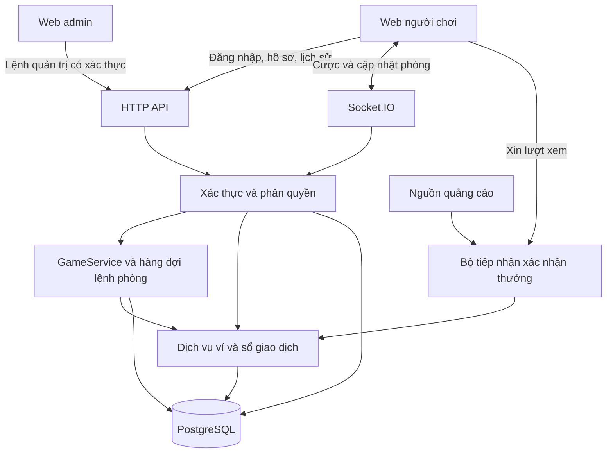

# Kế hoạch tài khoản, ví chung, quản trị và quảng cáo thưởng

## 1. Những yêu cầu đã chốt

- Tài khoản giữ hồ sơ và một ví xu chính dùng qua các phòng.
- Đổi phòng, đăng nhập lại hoặc đổi thiết bị không tạo ví mới.
- Hết xu có thể tự chọn xem quảng cáo để nhận xu chơi tiếp.
- Admin web quản lý người chơi, cấp xu, ban/xóa tài khoản và điều hành kết quả từng phòng.
- Host chỉ có quyền quản lý phòng gồm tạo phòng và kick người trong phòng mình; vẫn có quyền chơi thông thường như người chơi khác.
- Các quyền cấp xu, reset ví, chỉnh thời gian, tạm dừng, hủy ván, khóa phòng, đặt kết quả không còn thuộc host. Quản trị những mục này qua admin và quy tắc server.
- Các mặc định chi tiết dưới đây là đề xuất triển khai, không phải tính năng đã có hoặc lựa chọn đã được người dùng phê duyệt riêng.

## 2. Kiến trúc đề xuất

Giữ Node.js, Socket.IO và frontend hiện tại. Bổ sung các module xác thực, ví, quản trị và PostgreSQL vào cùng backend trước. Dùng cùng tên miền cho trang chơi, API, Socket.IO và `/admin` để đơn giản hóa phiên đăng nhập.

PostgreSQL là kho dữ liệu chính thức; RAM giữ kết nối/timer và bản sao trạng thái có thể dựng lại. Việc trừ xu và ghi cược phải cùng một transaction. [Tài liệu transaction PostgreSQL](https://www.postgresql.org/docs/current/tutorial-transactions.html).

Chưa cần tách microservice hoặc thêm nhiều instance ở bản đầu. Gói xác thực dùng thư viện được duy trì, không tự viết thuật toán mật mã. Chốt thư viện và phiên bản tương thích sau thử nghiệm nhỏ với Node 24 và môi trường triển khai.

## 3. Phân quyền bắt buộc tại server

| Thao tác | Người chơi | Host phòng | Admin hệ thống |
|---|---|---|---|
| Hồ sơ, ví và lịch sử cá nhân | Của mình | Của mình | Tra cứu theo quyền quản trị |
| Vào phòng, cược, xóa cược đúng hạn, mở bát, rời phòng đúng điều kiện | Có | Có | Nếu tham gia như người chơi |
| Tạo phòng | Có; trở thành host phòng mới | Có theo giới hạn hệ thống | Có |
| Kick người khác | Không | Chỉ phòng mình, không được kick admin hệ thống | Mọi phòng |
| Cấp xu vào ví chính | Không | Không | Có, ghi lý do và nhật ký |
| Reset số dư/hồ sơ người khác | Không | Không | Không sửa trực tiếp; điều chỉnh qua giao dịch có kiểm soát |
| Tạm dừng, khóa/hủy phòng, chỉnh thời gian | Không | Không | Có theo trạng thái ván |
| Cấu hình/chọn kết quả | Không | Không | Toànquyenchonketquacacphong            |
| Ban, gỡ ban, xóa tài khoản | Không | Không | Có, có lý do và xử lý cược đang chờ |
| Cấu hình quảng cáo thưởng | Không | Không | Có, áp dụng có phiên bản |

`ADMIN` là quyền tài khoản hệ thống, `HOST` là vai trò của thành viên trong một phòng. Tạo phòng không làm người chơi trở thành admin. Ẩn nút trên giao diện không thay thế kiểm tra quyền HTTP và Socket.IO. Khi host rời phòng, quy tắc server chọn người thay hoặc đóng phòng; host không tự cấp quyền hệ thống.

## 4. Đăng ký, đăng nhập và hồ sơ

### Tính năng bản đầu

- Đăng ký: tên đăng nhập duy nhất, tên hiển thị, email khôi phục và mật khẩu.
- Đăng nhập/đăng xuất; lấy lại hồ sơ và ví trên thiết bị khác.
- Hồ sơ: avatar có sẵn, tên hiển thị, ngày tham gia, số ván, thắng/thua và lịch sử xu.
- Đổi mật khẩu, quên mật khẩu qua email đã xác minh; quản lý phiên và đăng xuất thiết bị khác.
- Admin có xác thực hai bước trước khi mở bản quản trị công khai; tài khoản admin đầu tiên tạo bằng lệnh vận hành riêng, không tự đăng ký thành admin.
- Không thu thập số điện thoại, địa chỉ hoặc giấy tờ khi chưa có nhu cầu cụ thể.

### Cách xác thực đề xuất

- Băm mật khẩu bằng Argon2id với salt do thư viện quản lý. [OWASP Password Storage](https://cheatsheetseries.owasp.org/cheatsheets/Password_Storage_Cheat_Sheet.html).
- Dùng session ngẫu nhiên do server cấp, lưu bản băm token trong DB; trình duyệt giữ cookie `HttpOnly`, `Secure`, `SameSite=Lax` trên HTTPS. Đổi session khi đăng nhập và thu hồi khi đăng xuất. Áp dụng thời hạn tuyệt đối và thời hạn không hoạt động. [OWASP Session Management](https://cheatsheetseries.owasp.org/cheatsheets/Session_Management_Cheat_Sheet.html).
- Chống CSRF cho yêu cầu thay đổi dữ liệu; kiểm tra Origin cho kết nối web; không để token đăng nhập trong link mời hoặc localStorage.
- Giới hạn thử đăng nhập theo tài khoản và nguồn truy cập; thông báo lỗi không tiết lộ mật khẩu/email có tồn tại.
- Token đặt lại mật khẩu có hạn, dùng một lần, lưu băm; reset mật khẩu thu hồi các phiên cũ. Email thật cần dịch vụ gửi thư, tên miền và cấu hình vận hành. [OWASP Forgot Password](https://cheatsheetseries.owasp.org/cheatsheets/Forgot_Password_Cheat_Sheet.html).

Socket.IO lấy userId từ session đã xác thực. Middleware kết nối chỉ chạy một lần mỗi kết nối; do đó mỗi lệnh thay đổi cần kiểm tra phiên/quyền còn hiệu lực, và ban/logout phải ngắt hoặc vô hiệu socket hiện hữu. [Socket.IO Middlewares](https://socket.io/docs/v4/middlewares/).

## 5. Ví chung và chuyển phòng

### Quy tắc tiền

- Một tài khoản có một ví; xu chào mừng chỉ cấp một lần khi tạo tài khoản theo điều kiện đăng ký.
- Vào/tạo phòng không cấp lại 100K như `player()` hiện tại.
- Chọn chip chưa trừ tiền; khi server chấp nhận cược, ghi cược và trừ ví cùng transaction, sau đó mới ACK/phát trạng thái.
- Xóa cược hoặc hủy ván hợp lệ: hoàn đúng số đã giữ; trả thưởng cộng tổng nhận gồm hoàn gốc và lời.
- Mỗi thay đổi ví có loại, số tiền, số dư trước/sau, người thực hiện, mã yêu cầu và liên kết ván/lượt quảng cáo.
- Admin cấp xu bằng giao dịch `ADMIN_GRANT`, không ghi đè trực tiếp số dư. Gửi lại cùng yêu cầu không cấp thêm lần nữa.
- Các thao tác đồng thời khóa/cập nhật ví có điều kiện trong DB, giữ thứ tự khóa nhất quán; số dư không âm. [PostgreSQL locking](https://www.postgresql.org/docs/current/explicit-locking.html).

### Nhiều tab và nhiều thiết bị

Đề xuất bản đầu: tài khoản có thể đăng nhập nhiều nơi, nhưng chỉ một phòng đang chơi và một kết nối có quyền gửi cược. Thiết bị mới được tiếp quản có thông báo; các tab còn lại xem hoặc được yêu cầu đồng bộ. Quy tắc này phải được server kiểm tra bằng userId, không chỉ khóa nút phía client.

Người chơi có thể mang toàn bộ số dư sang phòng khác sau khi cược cũ được xóa hoặc đã chốt. Đóng tab/đăng xuất không hủy nghĩa vụ của cược đã nhận; server vẫn thanh toán. Kick/ban không được làm biến mất khoản cược.

Điều kiện vào phòng mới phải kiểm tra cược chưa chốt theo userId trong DB, kể cả người đó đã bị kick và không còn membership chủ động. Đề xuất chỉ chủ tài khoản/admin có quyền xem ví chính; snapshot cho người khác trong phòng chỉ có tên, avatar và tổng cược công khai, không chứa email, session hoặc lịch sử riêng.

### Ví chính và điều chỉnh kết quả

Người chơi dùng một ví chính xuyên suốt mọi phòng. Admin có quyền cấu hình kết quả cho bất kỳ phòng nào; hệ thống không gắn nhãn Demo, không hiện dấu hiệu riêng trên phòng và không gửi thông báo theo từng ván. Vì dự án dùng cho nghiên cứu, việc kết quả có thể được hệ thống quản trị điều chỉnh phải nằm trong điều khoản nghiên cứu/phiếu đồng ý mà người tham gia xác nhận trước khi sử dụng hệ thống.

Kết quả do admin cấu hình vẫn đi qua đúng một quy trình cược, chốt và thanh toán như kết quả ngẫu nhiên; không có nhánh cộng/trừ ví riêng ở client. Mọi lệnh điều chỉnh phải được lưu nội bộ để đối soát nghiên cứu, nhưng nhật ký này chỉ dành cho admin và không xuất hiện trong giao diện phòng.

## 6. Xem quảng cáo để nhận xu

### Luồng người chơi

1. Khi hết xu và không còn cược đang chờ thanh toán/hoàn, hiện số xu có thể nhận và nút tự nguyện xem quảng cáo.
2. Server kiểm tra điều kiện, trạng thái ban, giới hạn ngày, thời gian chờ và tạo lượt thưởng có hạn, gắn userId và mức thưởng cố định.
3. Quảng cáo được mở bằng tích hợp của nhà cung cấp; không cấp xu chỉ vì đếm đủ giây hoặc bấm đóng.
4. Bộ tiếp nhận xác nhận kết quả kiểm tra nguồn, trạng thái lượt và chống dùng lặp trước khi cộng `AD_REWARD`.
5. Trong một transaction: đánh dấu lượt đã nhận, tăng ví, ghi giao dịch; gửi số dư mới về các kết nối của tài khoản.

Mặc định tham khảo để cân chỉnh: 50.000 xu/lượt, tối đa 3 lượt/ngày, khoảng chờ 5 phút. Đây là đề xuất, chưa được chốt. Hạn mức được server giữ và kiểm tra nguyên tử để nhiều tab không vượt giới hạn; không đổi mức thưởng của lượt đang xem.

Không coi ALL IN làm ví khả dụng bằng 0 là đã thua hết tiền: phải chờ kết quả hoặc xóa cược. Hủy/quảng cáo không tải được thì không tính lượt thưởng đã nhận. Khi chưa có quảng cáo, hiển thị rõ và cho phép xem phòng, rời phòng hoặc quay lại sau; không hứa luôn có quảng cáo.

### Giới hạn tích hợp cần chốt trước khi làm

Google Ad Manager có rewarded ads cho web, nhưng tài liệu hiện ghi **SSV chỉ cho app, chưa có cho web**. Không áp dụng máy móc hướng dẫn AdMob Android/iOS cho website. [Tài liệu Google Ad Manager](https://support.google.com/admanager/answer/9116812?hl=en).

- Nhánh ưu tiên: chọn nhà cung cấp thật sự hỗ trợ rewarded web và bằng chứng server có thể xác minh (callback có chữ ký hoặc API xác nhận), sau khi thử tích hợp và kiểm tra điều kiện website/tài khoản.
- Nếu chọn hệ thống chỉ có callback trình duyệt như GPT: vẫn cộng xu ở server, dùng mã lượt một lần, giới hạn và theo dõi bất thường; nhưng các biện pháp này không chứng minh tuyệt đối người dùng đã xem quảng cáo. Phải ghi nhận mức chống gian lận thấp hơn, không quảng bá là SSV.
- Khi có webhook: kiểm tra chữ ký, thời hạn, userId/lượt quảng cáo, mã giao dịch nhà cung cấp duy nhất; callback gửi lặp chỉ cấp một lần. Callback đến muộn sau logout vẫn ghi đúng tài khoản, không phụ thuộc socket còn mở.
- Trường hợp callback tới sau ban/xóa hoặc quá hạn: lưu để đối soát, không tự tạo lại user hay mở khóa ví. Đề xuất đưa lượt có bằng chứng hoàn thành hợp lệ vào trạng thái chờ xét; admin xử lý có lý do và cùng mã chống lặp. Thời điểm hoàn thành và thời điểm callback đến phải được phân biệt khi nhà cung cấp cho phép xác minh.
- Kiểm thử bằng quảng cáo test; không tạo lượt xem quảng cáo thật giả để thử tải. Chuẩn bị đường xử lý không có quảng cáo và thiết bị không hỗ trợ.
- Xu chỉ dùng trong game, không rút/đổi tiền hay chuyển tặng giữa tài khoản. Xem quy định thưởng của mạng quảng cáo đã chọn trước khi phát hành. [Google reward policy](https://support.google.com/admanager/answer/7496282?hl=en).

Việc cấp thưởng từ server và việc xác minh lượt xem là hai việc riêng. Chưa chọn nhà cung cấp nên chưa thể khẳng định nhánh xác minh nào sẽ dùng.

## 7. Admin web

Trang riêng `/admin`, xác thực ở mọi API, kiểm tra quyền server và ghi nhật ký thao tác.

| Màn hình | Chức năng |
|---|---|
| Tổng quan | Người online thực, phòng đang hoạt động, ván lỗi, tổng xu cấp/thưởng theo thời gian |
| Người chơi | Tìm theo ID/tên/email, hồ sơ, ví, cược đang chờ, lịch sử; ban/gỡ ban/xóa mềm |
| Cấp xu | Chọn chính xác userId, số xu, lý do; hiển thị trước/sau; mã lệnh chống lặp |
| Phòng | Xem host/thành viên/pha/deadline; kick, khóa, tạm dừng, hủy hoặc đóng đúng trạng thái |
| Kết quả từng phòng | Chọn bất kỳ phòng đang chạy; đặt kết quả cho ngay ván hiện tại hoặc trả ván đó về chế độ ngẫu nhiên khi chưa chốt |
| Quảng cáo | Mức thưởng, giới hạn/ngày, thời gian chờ, lượt đang chờ/đã cấp/từ chối |
| Nhật ký | Ai làm gì, vào lúc nào, với tài khoản/phòng/ván nào; giá trị trước/sau và lý do |

### Quy tắc điều chỉnh kết quả đề xuất

- Chỉ admin; host không còn `host:result`.
- Lệnh chỉ đích danh `roomId` và `roundId` hiện tại, không dùng “phòng hiện tại” mơ hồ. Admin chọn xong thì server áp dụng ngay cho chính ván đang diễn ra.
- Cho phép đặt hoặc thay kết quả khi ván đang nhận cược, đã khóa cược hoặc đang ở hoạt cảnh lắc/mở bát, miễn `final_result` chưa được commit. Không sửa kết quả đã công bố và không tính lại lịch sử đã thanh toán.
- Khi admin gửi lệnh cùng lúc bộ đếm hết giờ, server phải khóa hàng dữ liệu của ván và phân xử nguyên tử: nếu lệnh admin commit trước thì engine dùng kết quả đó; nếu `final_result` đã commit trước thì lệnh bị từ chối. Phản hồi admin phải cho biết rõ lệnh đã áp dụng hay quá muộn.
- Áp dụng được cho mọi phòng và dùng chung ví chính. Không gắn nhãn Demo, không đổi giao diện phòng và không thông báo riêng trong từng ván.
- Thông tin kết quả có thể được quản trị điều chỉnh được công bố một lần trong điều khoản nghiên cứu trước khi người tham gia bắt đầu sử dụng; không cần lặp lại trong phòng.
- Trang admin phải hiển thị rõ chế độ hiện tại của từng ván (`random` hoặc `admin_scheduled`) để người vận hành không nhầm, nhưng trường này không được gửi trong snapshot công khai của phòng trước khi ván kết thúc.
- Mọi lựa chọn, lần thay đổi và người thực hiện đều được ghi lại; cấu hình hết hiệu lực sau ván hiện tại. Sai `roundId` hoặc ván đã chốt thì từ chối.

### Kick, ban, xóa tài khoản

- **Kick:** chỉ đưa khỏi phòng. Pha cược thì hoàn và đánh dấu hủy cược cùng giao dịch trước khi rời; pha khóa/lắc thì giữ cược trong DB tới lúc chốt, dù người chơi đã bị ngắt kết nối.
- **Ban:** chặn đăng nhập/cược/quảng cáo mới, thu hồi phiên; xử lý cược hiện hữu theo quy tắc trên. Ghi lý do, thời hạn hoặc vĩnh viễn; có gỡ ban.
- **Xóa:** bản đầu dùng xóa mềm, thu hồi phiên và ẩn hồ sơ; không cascade xóa cược/sổ xu. Sau khi xử lý hết cược, quy trình riêng có thể ẩn danh dữ liệu cá nhân theo chính sách lưu giữ đã chốt.
- **Đóng phòng:** admin có thể hủy cả ván đang cược hoặc đang lắc, phải ghi lý do. Lệnh hủy và lệnh chốt dùng cùng khóa/trạng thái ván: nếu hủy thắng thì đánh dấu canceled và hoàn đúng một lần; nếu chốt đã commit thì giữ thanh toán và chỉ đóng phòng. Đây là hủy toàn ván, khác kick một người. Tài khoản/ví không bị xóa theo phòng.
- **Đăng xuất:** không bị chặn bởi cược đang chờ; chặn thao tác mới, server vẫn xử lý cược đã nhận.

## 8. Thiết kế dữ liệu tối thiểu

| Bảng | Trường/trách nhiệm chính |
|---|---|
| `users` | UUID, username/email chuẩn hóa duy nhất, password_hash, display_name, avatar_key, role, status, created_at, deleted_at |
| `auth_sessions` | user_id, token_hash duy nhất, hạn tuyệt đối/không hoạt động, revoked_at, thông tin phiên tối thiểu |
| `account_tokens` | Xác minh email/đặt lại mật khẩu, token_hash, loại, hết hạn, used_at |
| `wallets` | user_id duy nhất, balance, version; số nguyên, giới hạn nghiệp vụ |
| `wallet_transactions` | user_id, loại, delta, balance_after, actor_id, room/round/reward tham chiếu, idempotency_key duy nhất theo phạm vi |
| `rooms`, `room_members` | Host, mode, trạng thái; user_id, joined_at, left_at; ràng buộc một phòng chơi chủ động |
| `rounds`, `bets` | deadline, trạng thái, kết quả đã chốt, số tiền/symbol/user_id, request_id; lịch sử bền vững |
| `ad_reward_sessions` | user_id, nhà cung cấp, nonce, mức thưởng, trạng thái, hết hạn, provider_transaction_id duy nhất khi có |
| `admin_audit_logs` | Admin thực hiện, hành động, mục tiêu, lý do, trước/sau, thời điểm; không ghi token/mật khẩu |

Số xu là số nguyên. Nếu dùng `BIGINT` trong DB, quy định biểu diễn/giới hạn khi đi qua JavaScript và JSON để tránh mất độ chính xác. Quyền sửa ví chỉ qua dịch vụ giao dịch; thống kê phải truy được từ lịch sử, không lấy số client gửi lên.

## 9. API và module triển khai

- Xác thực: đăng ký, đăng nhập, đăng xuất, đăng xuất tất cả, lấy tài khoản hiện tại, đổi/quên/đặt lại mật khẩu.
- Hồ sơ: đọc/sửa tên và avatar; đọc ví, giao dịch và lịch sử có phân trang. Lấy danh tính từ session, không tin userId của client.
- Thưởng quảng cáo: xin lượt, xem trạng thái; endpoint nhận xác nhận phù hợp nhà cung cấp. Không có API công khai “cộng X xu” tin lời trình duyệt.
- Admin: danh sách người/phòng, cấp xu, ban/gỡ ban/xóa mềm, điều hành phòng, cấu hình thưởng và nhật ký.
- Socket.IO: giữ các sự kiện chơi cần thiết, thay lệnh đặc quyền host bằng kiểm tra admin rõ; xác thực phiên hết hạn/revoke ở mỗi thao tác.

Tách `auth`, `accounts`, `wallet`, `rewards`, `admin`, `repositories` và phần phục hồi game. `GameService.handle()` hiện đồng bộ; tích hợp DB cần chuyển đường xử lý sang async và chỉ ACK/broadcast sau commit. Serialize lệnh theo phòng và kiểm tra wallet trong transaction để tránh chốt ván đua với cược cuối giờ. Timer/khôi phục cũng phải đi cùng đường xử lý.

## 10. Lộ trình triển khai

| Bước | Công việc | Nghiệm thu |
|---|---|---|
| 1 | Chốt schema/quyền, migration, PostgreSQL local/test | Tạo dữ liệu và chạy lại migration theo hướng dẫn được |
| 2 | Auth + cookie/session + hồ sơ + Socket.IO có danh tính | Đăng nhập lại/thiết bị khác đúng user; logout/ban vô hiệu socket cũ |
| 3 | Ví chung + cược/thưởng/hoàn bền vững + phục hồi | Sang phòng khác không tạo thêm xu; restart không mất/trừ/thưởng lặp |
| 4 | Admin web và thu hẹp quyền host | Host gọi trực tiếp lệnh admin vẫn bị từ chối; cấp/ban/kick đều có log |
| 5 | Thử provider quảng cáo, tích hợp thưởng và giới hạn | Xác định được cách xác minh; lượt lặp/nhiều tab không nhận nhiều lần; lỗi tải được xử lý |
| 6 | Kiểm thử thiết bị, nhiều tài khoản, sao lưu/phục hồi và triển khai HTTPS | Hai máy cùng chơi ổn; tài khoản/tiền tồn tại sau restart; quản trị truy vết được |

Không đưa ví tài khoản vào cược thật cho tới khi bước 3 hoàn thành. Có thể dựng UI/auth trước nhưng phải ghi rõ trạng thái thử nghiệm.

### Chuyển từ hệ thống hiện tại

- Đối tượng player hiện tại và tên hiển thị không đủ để chứng minh quyền sở hữu một tài khoản mới. Không tự nhập ví cũ theo tên trùng hoặc theo số dư client.
- Chọn đợt chuyển đổi sau khi các phòng cũ kết thúc; tài khoản mới nhận xu chào mừng một lần. Nếu cần chuyển dữ liệu cũ, thiết kế riêng cơ chế xác minh quyền sở hữu.
- Frontend/backend phát hành cùng phiên bản; bỏ lớp suy diễn số dư cũ sau chuyển đổi.
- Thay `room:resume` chỉ dựa token RAM bằng xác thực user + membership; kết nối lại không tạo tài khoản/ví mới.
- Khi restart: ván chưa có kết quả bền vững được hủy và hoàn; ván đã có kết quả bền vững được hoàn tất thanh toán đúng một lần. Đóng/khôi phục phòng chỉ sau bước đối soát này.
- Tách `admin_override_result` có thể cập nhật trong ván hiện tại khỏi `final_result` bất biến và trạng thái chốt do engine commit. Khi chốt, engine đọc override trong cùng transaction rồi ghi `final_result`; phục hồi chỉ căn cứ kết quả đã chốt bền vững, không coi một override chưa chốt là kết quả đã thanh toán.
- Nếu DB hỏng/mất kết nối, tạm chặn cược và cấp thưởng mới, không chuyển sang tự ghi ví RAM.

## 11. Bộ kiểm thử bắt buộc

1. Đăng ký trùng đồng thời chỉ tạo một tài khoản/ví và một khoản chào mừng.
2. Đăng xuất/đổi mật khẩu/ban làm phiên cũ không còn gửi cược được; tài khoản khác không đọc lịch sử riêng bằng đổi ID.
3. Cùng tài khoản ở hai tab/thiết bị không có hai ví, hai khoản chào mừng hoặc hai quyền cược độc lập.
4. Cược/ALL IN/xóa/hủy/thắng/thua/cấp xu đều đối chiếu được từ sổ giao dịch; retry và timeout không ghi lặp.
5. Cược đua với hết giờ, ban, kick và đóng phòng có kết quả xác định; không làm mất xu.
6. Restart trước/sau commit trả thưởng không sinh kết quả khác, không trả lần hai.
7. Host không cấp xu, reset ví, đặt kết quả hay truy cập admin bằng HTTP/Socket trực tiếp.
8. Quảng cáo bị hủy, không có quảng cáo, callback sai/lặp/chậm, đổi cấu hình giữa lượt và nhiều tab đều được xử lý.
9. Xu bằng 0 do ALL IN chưa chốt không mở lượt thưởng hết xu; vượt hạn mức không nhận thêm.
10. Ban/xóa mềm giữ bản ghi tiền, xử lý cược chưa chốt; backup và restore có đối soát.

## 12. Những quyết định còn cần chốt khi triển khai

- Mức thưởng/ngày, cooldown, điều kiện đăng ký nhận xu lần đầu và cách xử lý lượt xác nhận muộn.
- Nhà cung cấp quảng cáo, điều kiện chấp nhận website và cơ chế xác minh web thực tế.
- Nhà cung cấp email, hosting/database và cấu hình HTTPS; chưa đăng ký hay phát sinh chi phí trong kế hoạch.
- Cách trình bày điều khoản nghiên cứu và lưu bằng chứng người tham gia đã đồng ý trước khi chơi; trong phòng không gắn nhãn hay thông báo theo từng ván.
- Thời hạn phiên, ban, lưu giữ dữ liệu và số thiết bị có thể đăng nhập; đề xuất một quyền chơi chủ động ở bản đầu.

Các mục này không cản trở việc thiết kế schema, module auth và kiểm thử phân quyền trước.
